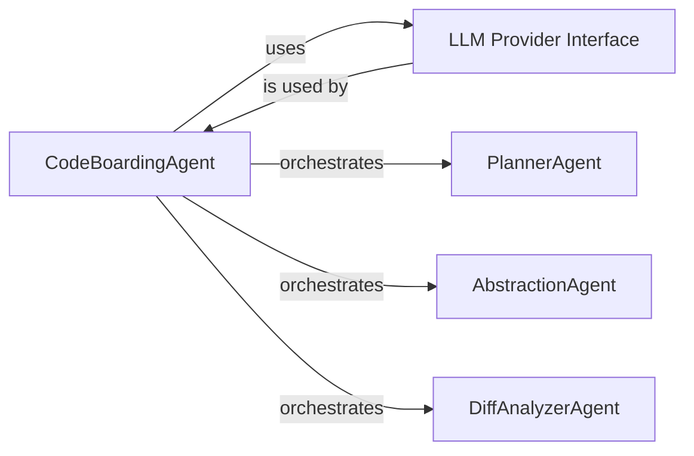

# AI-Driven Abstraction & Component Modeling

Unlock the power of large language models (LLMs) within CodeBoarding's AI Analysis Engine to generate high-level abstractions and comprehensive component models from raw static code data. This guide walks you through how the AbstractionAgent and related LLM-powered agents transform intricate code structures into digestible, multi-level insights that drive accurate architectural understanding and interactive documentation.

---

## Introduction

CodeBoarding leverages LLM agents to enhance static analysis data by discovering architectural patterns, abstracting core components, and generating layered explanations. The AI analysis employs a multi-agent system where specialized agents perform distinct cognitive tasks that collectively produce a rich, high-level model of your codebase.

Specifically, the **AbstractionAgent** focuses on extracting meaningful abstractions by distilling complex code details into manageable concepts, enabling faster onboarding, clearer documentation, and actionable insights.

---

## The Role of Abstraction in CodeBoarding

Think of CodeBoarding's abstraction process as turning a sprawling city map cluttered with every street sign into a clean, layered atlas highlighting districts, important landmarks, and transit pathways — making navigation and orientation effortless.

The AbstractionAgent accomplishes this by:

- **Summarizing code sections:** Condensing detailed source code and graph information into concise descriptive insights.
- **Identifying design patterns:** Recognizing common architectural structures (e.g., MVC, microservices) to contextualize components.
- **Generating multi-level explanations:** Creating summaries that range from granular details to overarching component roles.

This abstraction enables users to grasp the architecture without wading through raw code or overwhelming static graphs.

---

## How the Abstraction Agent Works

The AbstractionAgent is a specialized AI entity within the AI Analysis Engine. It interacts closely with the static analysis data, using iterative prompt-based methods with LLMs to refine its understanding and output.

### Workflow Breakdown

1. **CFG Analysis (Control Flow Graph)**
   - Starts by receiving CFG string data representing the flow and relationships within the code.
   - Uses templated prompts customized with project context to guide the LLM in extracting structural insights.

2. **Source Code Summarization**
   - Aggregates evolving insights, like CFG findings and any partial abstractions.
   - Invokes the source analysis prompt to deepen the understanding of components, their interactions, and responsibilities.

3. **Final Multi-Level Analysis Generation**
   - Combines previous insights along with project metadata in a comprehensive prompt.
   - Produces the final structured abstraction output, detailing high-level design, component roles, and architecture patterns.

4. **Feedback Incorporation**
   - Accepts validation insights or user feedback to iteratively refine abstraction results for accuracy and clarity.

### Iterative Refinement Example

Imagine you're drafting an executive summary:

- First, you outline key facts (CFG insights).
- Then, you expand on implications and context (source analysis).
- Finally, you rewrite and polish the summary, applying peer feedback (feedback loop).

The AbstractionAgent operates with a similarly progressive refinement methodology.

---

## Key Components & Concepts

### Multi-Agent Collaboration

The AI Analysis Engine orchestrates several agents working in concert:

- **CodeBoardingAgent:** The central coordinator, managing workflow, LLM interactions, and agent orchestration.
- **LLM Provider Interface:** Abstracts communication with different LLM vendors, ensuring flexibility and consistency.
- **PlannerAgent:** Strategically plans elaboration steps, defining which components need deeper analysis.
- **AbstractionAgent:** Performs the core task of abstraction and summary generation.
- **DiffAnalyzerAgent:** Handles change detection and impact analysis between code states.

### Prompt Templates

The AbstractionAgent uses carefully designed prompt templates to structure communication with LLMs, ensuring relevant context and clarity for each analysis step. This controlled prompting enables:

- Consistency across analysis runs.
- Flexible adaptation to different project types.
- Clear separation of concerns between CFG analysis, source analysis, and final output.

### Metadata & Project Context

Project metadata — including project type, language, and domain context — is integrated into all abstraction prompts. This grounding improves the relevance and precision of generated explanations.

---

## Example User Flow: Generating a High-Level Component Abstraction

### Step 1: Provide Project and CFG Data

The user triggers an analysis, submitting the source code. The system extracts the CFG data and passes it to the AbstractionAgent.

### Step 2: Run CFG Step

The agent processes the CFG through the LLM, producing initial structural insights that describe control flow, key modules, and dependencies.

### Step 3: Analyze Source

Building on CFG insights, the agent analyzes specific source components, refining its understanding of class roles, patterns, and interactions.

### Step 4: Generate Final Analysis

The agent synthesizes its findings into a high-level model and explanatory output, highlighting architecture layers and functional groupings.

### Step 5 (Optional): Apply Feedback

If a reviewer or automated validator provides feedback (e.g., clarifications or corrections), the agent reprocesses its output incorporating this input to improve accuracy.

---

## Practical Tips for Success

- **Provide Rich Project Metadata:** Supplying accurate project context (e.g., domain, technology stack) enhances abstraction quality.
- **Iterate with Feedback:** Leverage the AbstractionAgent’s feedback mechanism to refine outputs, especially for complex or unfamiliar codebases.
- **Balance Abstraction Depth:** Adjust analysis depth settings to control the granularity of abstractions based on user needs.
- **Monitor Prompt Cost:** Complex prompts consume more LLM token resources; optimize prompt inputs accordingly.

---

## Common Pitfalls & Troubleshooting

<Accordion title="Abstraction results are too vague or generic">
If abstractions lack actionable detail, ensure the project metadata is complete. Increase the prompt context or provide additional code samples to help the LLM discern specifics.
</Accordion>

<Accordion title="LLM responses are inconsistent across runs">
Variability can stem from non-deterministic LLM model behavior. Use temperature settings close to zero and fixed random seeds if supported by the provider to boost consistency.
</Accordion>

<Accordion title="Feedback application does not meaningfully change output">
Validate that the feedback input is precise and relevant. The agent expects structured, clear feedback in its predefined format to apply improvements.
</Accordion>

---

## System Interaction Diagram

This diagram shows the central role of CodeBoardingAgent coordinating the LLM interactions and specialized analysis agents.

---

## Related Components & Further Reading

- [Static Code Analyzer](./Static_Code_Analyzer.md): Learn how raw code is parsed into structured graphs that feed into the abstraction process.
- [Orchestration Workflow](./Orchestration_Workflow.md): Understand how the entire analysis pipeline coordinates between components.
- [Output Generator](./Output_Generator.md): See how the abstraction results are transformed into interactive diagrams and documentation.
- [PlannerAgent Documentation](agents/planner_agent.py): Discover how strategic planning of component expansion supports the abstraction workflow.

---

## Summary

The AI-Driven Abstraction & Component Modeling page illuminates how CodeBoarding uses LLM agents, especially the AbstractionAgent, to convert complex static code analysis data into meaningful and layered architectural insights. Users gain an understanding of the agent-driven workflow for generating abstractions, incorporating feedback, and orchestrating multi-agent collaboration to produce comprehensive, high-level component models that accelerate code comprehension and documentation.

---

## References

- `agents/abstraction_agent.py` — Implementation of AbstractionAgent
- `.codeboarding/AI_Analysis_Engine.md` — High-level AI Analysis Engine overview
- `agents/planner_agent.py` — Details on analysis planning agent
- `.codeboarding/Static_Code_Analyzer.md` — Static code parsing foundation
- `.codeboarding/Output_Generator.md` — How the final results are rendered

---