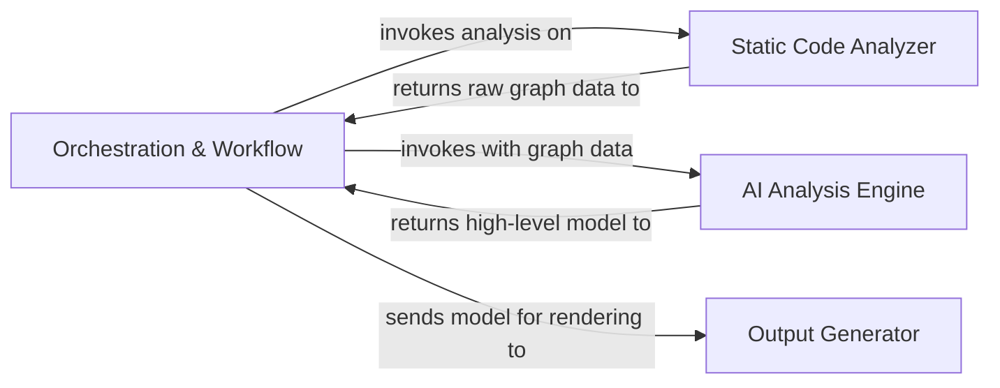
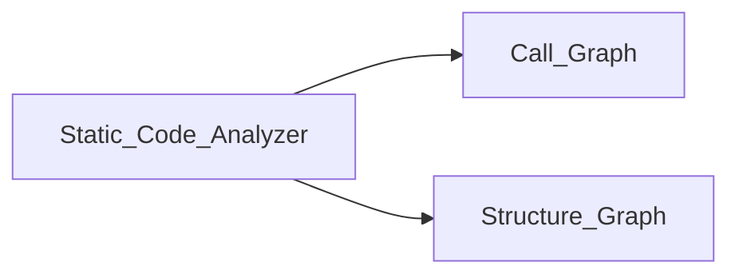

# Diagram & Output Data Structures

Explore how CodeBoarding translates its analysis results into interactive diagrams and persistent data models. This page clarifies the underlying JSON schema, data organization, and output formats, giving you a comprehensive understanding of how raw and processed data become accessible visualizations and consumable artifacts.

---

## Understanding the Output Data Structures

At the core of CodeBoarding's value is the transformation of complex code analysis data into clear, navigable representations. These are organized in structured JSON formats that serve both as persistent storage models and as sources for rendering various output formats.

### Key Data Artifacts

- **Analysis Insight Model (JSON)**: The primary serialized format encapsulating all components, their relationships, metadata, and hierarchical abstractions produced from static and AI-driven analysis.
- **Diagram Representations (Mermaid.js, Mermaid JSON, Cytoscape.js)**: The schematic views representing interactions and architecture of analyzed code components.
- **Output Files (Markdown, HTML, MDX)**: User-facing documentation formats embedding the diagrams and descriptive details.

These artifacts form the bridge between raw analysis and intuitive user experience.

---

## Anatomy of the Analysis Insight Model

The Analysis Insight Model is a JSON schema that captures the entire scope of the analysis at multiple levels:

- **Components**: Individual modules, classes, or services identified.
- **Component Attributes**: Descriptions, source references, metadata enriching each component.
- **Relations**: Directed connections describing dependencies or flows between components.
- **Hierarchy**: Support for nesting or grouping components to represent subsystem structure.

This model is generated by the AI Analysis Engine and persisted by the Data Persistence component to enable caching, incremental updates, and seamless integration.

<AccordionGroup title="Analysis Insight Model Details">
<Accordion title="Example Component Entry">
```json
{
  "name": "Static Code Analyzer",
  "description": "The initial parsing component that uses AST to extract code metadata.",
  "referenced_source_code": [
    {
      "qualified_name": "static_analyzer/pylint_analyze/call_graph_builder.py",
      "reference_file": "/path/to/call_graph_builder.py",
      "reference_start_line": null,
      "reference_end_line": null
    }
  ]
}
```
</Accordion>
<Accordion title="Example Relation Entry">
```json
{
  "src_name": "orchestration_workflow",
  "relation": "sends raw code or analysis requests to",
  "dst_name": "Static Code Analyzer"
}
```
</Accordion>
</AccordionGroup>

---

## Generating Interactive Diagrams

### Mermaid.js Diagrams

Mermaid.js is the primary diagramming framework used in Markdown and MDX outputs. It allows embedding of readable flowcharts, graphs, and sequence diagrams directly in documentation.

- **Data Source**: Components and their relations from the Analysis Insight Model.
- **Rendering**: The Output Generator converts structured models into Mermaid.js syntax.
- **Use Cases**: Visualize module dependencies, architecture flows, and control structures.



*Example: High-level component orchestration illustrated via Mermaid.*

---

### HTML & Cytoscape.js Data

For richer, interactive web views, CodeBoarding generates HTML pages leveraging Cytoscape.js:

- **Structure**: Data from the analysis insights is translated into nodes (components) and edges (relations) in JSON format.
- **Interactivity**: Users can hover, click, and navigate through components in the browser.
- **Cross-linking**: Details link to source code references and expandable component pages.

<Info>
The HTML output generator detects available linked source files to enable direct navigation from diagrams to code, enhancing the exploratory developer experience.
</Info>

---

## Output Formats: Markdown, HTML, and MDX

Each format serves specific user contexts:

- **Markdown**: Best for embedding in GitHub, static docs, or plain-text friendly environments. Supports Mermaid.js for inline diagrams.
- **HTML**: Facilitates advanced interactive exploration using Cytoscape.js, suitable for web portals and internal docs.
- **MDX**: Enables JSX/React integration for embedding dynamic diagrams in modern documentation frameworks.

<AccordionGroup title="Output Format Details">
<Accordion title="Markdown with Mermaid">

Structured Markdown files embed Mermaid.js graph syntax, allowing easy visualization in platforms like GitHub or VS Code. Typically, component details and relations are documented with expandable sections.

Example snippet:

```markdown
## Static Code Analyzer

Responsible for transforming source code into ASTs and call graphs.


```

</Accordion>
<Accordion title="HTML with Cytoscape.js">

HTML files include:

- A visualization canvas powered by Cytoscape.js.
- JSON data structures describing nodes and edges.
- Interactive features such as zoom, pan, and clickable elements linking to component details.

Example structure snippet:

```json
{
  "elements": [
    {
      "data": {
        "id": "Static_Code_Analyzer",
        "label": "Static Code Analyzer"
      }
    },
    {
      "data": {
        "id": "edge_0",
        "source": "Orchestration_Workflow",
        "target": "Static_Code_Analyzer",
        "label": "invokes analysis on"
      }
    }
  ]
}
```

</Accordion>
<Accordion title="MDX Embedding">

MDX files allow integration of what Markdown and HTML provide with React-based interactive components, offering advanced UI/UX capabilities within documentation sites like Docusaurus.

This allows developers and architects to embed live diagrams, toggle views, and interactive data visualization within their knowledge portals.

</Accordion>
</AccordionGroup>

---

## How Diagram Generation Fits Into the Workflow

1. After the **Static Code Analyzer** processes raw code, it generates foundational graph data.
2. The **AI Analysis Engine** refines this into rich models containing architectural insights.
3. The **Orchestration Workflow** coordinates this flow and passes analysis to the **Output Generator**.
4. The Output Generator creates JSON artifacts and renders diagrams and documentation files in Markdown, HTML, or MDX.

This progressive flow ensures that every diagram and data model is grounded in thorough analysis and structured metadata.

---

## Practical Tips for Working With Output Data

- Ensure your `REPO_ROOT` and `ROOT_RESULT` environment variables are correctly set to resolve source references.
- Use the interactive HTML outputs to explore large codebases with clickable navigation.
- Markdown/MDX outputs are ideal for incorporating into CI/CD documentation pipelines and IDEs.
- Use partial updates by targeting components to efficiently regenerate diagrams after code changes.

<Warning>
Always validate generated diagram files for completeness after major codebase changes. Missing nodes or edges typically indicate interrupted or incomplete analysis runs.
</Warning>

---

## Troubleshooting Common Output Issues

- **Diagrams missing components or edges**: Confirm the JSON analysis model files exist and were generated completely.
- **Broken links in HTML diagrams**: Verify linked source code files are accessible at configured repo paths.
- **Rendering errors in Mermaid diagrams**: Check Mermaid syntax generated in the Markdown or MDX files, especially for complex graphs.

<Check>
Ensure environment variables are consistent and that no manual edits corrupt JSON or Mermaid outputs.
</Check>

---

## Related Documentation

- [Static Code Analyzer](./Static_Code_Analyzer.md) — Understanding how raw code is parsed and structured
- [AI Analysis Engine](./AI_Analysis_Engine.md) — How AI abstracts and enriches code models
- [Orchestration Workflow](./Orchestration_Workflow.md) — Insight into process coordination
- [Output Generator](./Output_Generator.md) — Details on generating multi-format outputs
- [Understanding Codeboarding Diagrams](../../guides/getting-started/understanding-diagrams.mdx) — A practical guide on reading and using generated diagrams

---

Transforming abstract code analysis into tangible, actionable documentation is at the heart of CodeBoarding’s mission. Understanding the underlying Data Structures & Diagram Outputs empowers you to harness the tool effectively, enabling faster onboarding, clearer architecture visualization, and seamless integration into existing workflows.

---

[Return to Concepts Overview](../../concepts/core-analysis-models/concept-diagram-generation.mdx)

---