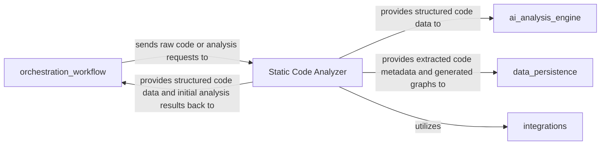

# Static Analysis Model

Understand the static analysis techniques that enable CodeBoarding to extract control flow graphs, module connections, and project hierarchies. This page covers domain-specific terminology such as control flow graph and structure graph, and the approach to reliable extraction of structural insights from source code.

---

## Introduction

Static analysis in CodeBoarding serves as the foundational step for turning raw source code into a structured, machine-readable format. By analyzing code without executing it, CodeBoarding constructs essential artifacts like Abstract Syntax Trees (ASTs), Control Flow Graphs (CFGs), Call Graphs, and Structure Graphs. These artifacts capture the project's internal flows, dependencies, and hierarchies, enabling subsequent AI-driven agents to generate rich, high-level insights.

This model focuses on extracting precise structural information from the source code to reveal module interactions, code organization, and execution pathways. It is a critical enabler for CodeBoarding’s capability to generate accurate, human- and agent-readable diagrams that reflect the real software architecture.

---

## Key Concepts and Terminology

### Abstract Syntax Tree (AST)
An AST is a tree representation of the source code's syntactic structure. Each node represents a programming construct (e.g., expressions, statements, declarations), capturing the hierarchical relationship of code elements without concern for execution order.

### Control Flow Graph (CFG)
A CFG models the flow of control within the program, mapping how execution progresses through the code. Nodes in the CFG represent basic blocks or instructions, and edges show control transfer paths such as branches, loops, and function calls. CFGs are essential for understanding runtime behavior and module interactions.

### Call Graph
The Call Graph illustrates the calling relationships between functions or methods in the codebase. It identifies which functions invoke which others, highlighting dependencies and interaction patterns.

### Structure Graph
The Structure Graph captures higher-level organization, including module hierarchies, classes, interfaces, and other structural elements. It shows composition and containment relationships critical for architectural understanding.

---

## Static Analysis Workflow

1. **Input Reception**
   - The `orchestration_workflow` component sends raw source code or analysis requests to the `Static Code Analyzer`.

2. **AST Parsing**
   - The `Static Code Analyzer` parses source code using Abstract Syntax Tree-based techniques, generating detailed ASTs, capturing the syntactic details of the code.

3. **Graph Construction**
   - From ASTs, key graphs are built:
     - **Call Graphs** to map function calls
     - **Control Flow Graphs** for execution paths
     - **Structure Graphs** for module and class hierarchies

4. **Extraction of Metadata**
   - Essential metadata, including node details, edge relationships, and code locations, are extracted to form a foundational, structured data format.

5. **Data Provision**
   - The analyzer provides this structured code data and initial analysis results back to the `orchestration_workflow` and also forwards it to the `AI Analysis Engine` for advanced interpretation.

6. **Persistence and Integration**
   - Extracted metadata and graph structures are stored securely in `data_persistence` for future retrieval, comparison, and caching.
   - The `Static Code Analyzer` relies on `integrations` to interact with external services such as version control and CI/CD pipelines.

---

## Component Overview

### Static Code Analyzer
- **Purpose:** Perform the core static code parsing and graph generation.
- **Function:** Converts raw source files into ASTs, builds CFGs, call graphs, and structure graphs.
- **Outcome:** Produces essential structured data for AI agents and other processing components.
- **Related Source Code:**
  - `static_analyzer/pylint_analyze/call_graph_builder.py`
  - `static_analyzer/pylint_analyze/structure_graph_builder.py`

### orchestration_workflow
- Acts as the central coordinator managing the flow of analysis.
- Receives raw input and triggers static analysis.
- Ensures smooth data handoff to AI components and persistence layers.

### ai_analysis_engine
- Consumes the structured static analysis output for AI-driven abstraction.
- Goes beyond traditional static parsing to identify architectural patterns and optimization areas.

### data_persistence
- Stores and manages all generated analysis artifacts securely.
- Ensures analysis results are available for history, comparisons, and reporting.

### integrations
- Facilitates standardized communication with external systems (e.g., GitHub, CI/CD).
- Provides source code access and other integration points necessary for analysis.

---

## Understanding Control Flow and Structure in Static Analysis

### Control Flow Graphs (CFGs)
- Represent paths that might be traversed during program execution.
- Key for discovering how functions and modules interact at runtime.
- Helps identify possible execution branches, loops, and decision points.

### Structure Graphs
- Capture the static organization of code elements.
- Represent module dependencies, class hierarchies, and file-level groupings.
- Serve as a blueprint for architectural visualization.

Together, CFGs and Structure Graphs provide complementary views: control behavior and static organization.

---

## How Static Analysis Supports Reliable Extraction

- **AST-based Parsing** ensures syntactical correctness and comprehensive code coverage.
- **Separation of Concerns** keeps static parsing distinct from AI processing, enhancing reliability.
- **Graph Generation from ASTs** provides a robust and formalized representation of code flows.
- **Metadata Extraction** captures precise source locations, enabling traceability.
- **Persistent Storage** enables caching and incremental analysis to improve efficiency and accuracy over time.

---

## Visual Representation

---

## Practical Tips and Best Practices

- Ensure the source code provided to the system is complete and correctly organized to enable precise AST generation.
- Use supported languages and frameworks that align with the analyzer's capabilities.
- Regularly validate analysis outputs to detect parsing or graph generation anomalies early.
- Leverage persistent storage to avoid redundant analysis and accelerate subsequent runs.
- Integrate with version control systems via the `integrations` component to maintain up-to-date analysis.

---

## Troubleshooting Common Issues

- **Incomplete or Invalid Graphs:** Verify code base completeness and syntax correctness before running static analysis.
- **Missing Function or Module Links:** Check for unsupported language constructs or dynamic features that static analysis cannot capture fully.
- **Performance Bottlenecks:** Large codebases may require tuning analysis depth or enabling caching in the orchestration workflow.
- **Integration Failures:** Confirm external system credentials and network access are properly configured.

For deeper troubleshooting, consult the [Orchestration Workflow](./Orchestration_Workflow.md) and [Static Code Analyzer](./Static_Code_Analyzer.md) documentation.

---

## Next Steps

Once you understand the static analysis model, explore related areas to grasp the full flow:

- [End-to-End Analysis Journey](../core-architecture-overview/concept-end-to-end-analysis-journey.md) to see how static analysis fits within the wider system.
- [AI Analysis Engine](../../concepts/core-analysis-models/concept-ai-llm-analysis.md) for insights on how structured data drives AI abstraction.
- [System Architecture Overview](../core-architecture-overview/concept-architecture-essentials.md) to understand component interactions.

---

For detailed implementation and usage, refer to the source code in the [`static_analyzer/pylint_analyze`](https://github.com/CodeBoarding/CodeBoarding/tree/main/static_analyzer/pylint_analyze) directory.

---

*This page is part of the CodeBoarding concepts guide, focused exclusively on the static analysis foundations that power the system's understanding of codebases.*