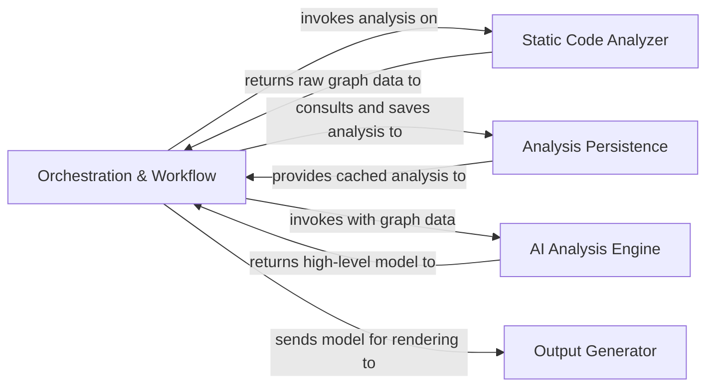

# System Architecture Essentials

---

This guide presents a high-level narrative of CodeBoarding's system design. It explains the key components — the Orchestration Workflow, Static Code Analyzer, AI Analysis Engine, and Output Generator — and how they interact to deliver a seamless code analysis experience. Understanding these foundational blocks will orient you to the mental model behind CodeBoarding’s approach to codebase comprehension.

---

## Overview of Core Components

CodeBoarding's architecture is a coordinated pipeline where each component plays a critical role in analyzing a codebase and producing insightful documentation and diagrams.

### Orchestration Workflow

The orchestration workflow is the heart of the system — the central coordinator that manages the entire analysis pipeline from start to finish. It receives raw code or analysis requests and triggers the static analysis phase. Once raw code data is structured, it proceeds to invoke the AI Analysis Engine for advanced interpretation. It also manages caching and persistence for efficiency, storing and retrieving analysis results to avoid redundant computation. When the analysis pipeline completes, it sends the final, refined results to the Output Generator for rendering into user-friendly documentation.

- It oversees sequencing of operations to maintain smooth data flow.
- Manages interaction between static analysis, AI-driven processing, and result rendering.
- Handles caching logic to improve performance and support incremental analysis.

### Static Code Analyzer

The Static Code Analyzer performs the essential first step — converting raw source code into structured, machine-interpretable data. Utilizing Abstract Syntax Tree (AST) parsing and control flow graph (CFG) techniques, it generates foundational data structures such as call graphs and structure graphs.

This component:
- Parses source code without AI, ensuring deterministic, robust extraction of metadata.
- Builds rich representations of code relationships — essential inputs for AI agents.
- Supplies both the orchestration workflow and the AI Analysis Engine with structured code data.

Its role is crucial because it transforms the chaotic, raw code into an organized format that facilitates deeper, semantic analysis.

### AI Analysis Engine

At the cognitive core lies the AI Analysis Engine — a multi-agent framework that takes structured data from the static analyzer and generates a high-level architectural understanding.

Features include:
- A set of specialized AI agents like the PlannerAgent (for strategic task sequencing), AbstractionAgent (for creating higher-level summaries), and DiffAnalyzerAgent (for understanding code changes).
- Use of Large Language Models (LLMs) to interpret, synthesize, and conceptualize the codebase beyond what traditional static analysis can deliver.
- Collaborative orchestration by a central CodeBoardingAgent entity, managing prompt workflows and agent interactions.

By leveraging AI, this engine identifies architectural patterns, clarifies component roles, and provides meaningful abstractions that help users grasp complex systems effectively.

### Output Generator

The final step in the process is the Output Generator. It consumes the rich, structured analysis model created by the AI Analysis Engine and renders it into multiple human-readable formats:

- Markdown to support easy integration into documentation repositories.
- HTML for web-based presentation.
- Sphinx documentation format for structured API and architecture docs.
- MDX, facilitating modern React-based documentation sites.

This component focuses on streamlining output to produce clear, interactive visuals, primarily using Mermaid.js diagrams, making the insights accessible to engineers, architects, and onboarding teams.

---

## Data Flow Journey Through Components

Understanding how data travels helps grasp how CodeBoarding delivers value:

1. **Input & Trigger:** The process begins when a user submits a codebase or analysis request (e.g., via CLI or API), handled by the Orchestration Workflow.
2. **Static Parsing:** The Orchestration Workflow sends raw code to the Static Code Analyzer.
3. **Structured Data Generation:** The Static Analyzer parses source files, constructs ASTs, call graphs, and extracts metadata.
4. **Feedback Loop:** It returns raw graph data to the Orchestration Workflow.
5. **Caching:** The Orchestration Workflow checks if prior analyses exist in Analysis Persistence. If so, it retrieves cached data.
6. **AI Interpretation:** Using the graph data, the Orchestration Workflow invokes the AI Analysis Engine.
7. **Architectural Modeling:** AI agents collaborate to build higher-level component abstractions, architectural patterns, and interaction summaries.
8. **Results Forwarding:** The AI engine returns the enriched architectural model to Orchestration Workflow.
9. **Persistence:** The workflow saves this enriched model back into Analysis Persistence for future reuse.
10. **Rendering:** Finally, the Orchestration Workflow sends the model to the Output Generator.
11. **User Delivery:** Outputs are generated as documentation and interactive diagrams for user exploration.

---

## Practical User Scenarios

Imagine you are onboarding onto a large Python project:

- You initiate an analysis run on your target repository.
- The orchestration workflow manages the end-to-end process, invisibly coordinating the static code parsing and advanced AI-driven modeling.
- You receive a set of rich, navigable diagrams highlighting core modules, their relationships, and design patterns — all based on both deterministic static analysis and AI insight.
- You can customize how deep the abstraction goes or integrate the results into your CI/CD pipelines using supported integrations.

This approach accelerates understanding and reduces the cognitive load on new engineers.

---

## Tips and Best Practices

- **Leverage Caching:** Use the persistence layer features to speed up repeated analyses, especially when working with incremental code changes.
- **Choose Appropriate LLM Providers:** The AI Analysis Engine supports multiple LLM vendors; align provider choice with performance and cost considerations.
- **Monitor Orchestration Logs:** The orchestration workflow logs provide critical insights into pipeline status and can help diagnose failures.
- **Customize Output:** Modify the Output Generator settings to tailor documentation formats or integrate into existing documentation frameworks.

---

## Troubleshooting Common Issues

- **Delayed analysis or timeouts:** Check if the orchestration workflow stalled, verify caching behavior, and confirm LLM provider availability.
- **Incomplete diagrams:** Validate that the Static Code Analyzer successfully parsed all source files and that AI agents completed their runs.
- **Errors in output formats:** Inspect the output generator’s logs for transformation errors or missing dependencies.

If issues persist, consult the detailed logs of each component and verify environment variable configurations.

---

## Further Exploration

- [Orchestration Workflow Documentation](https://github.com/CodeBoarding/CodeBoarding/blob/main/.codeboarding/Orchestration_Workflow.md) – Dive deeper into how orchestration coordinates the analysis pipeline.
- [Static Code Analyzer Details](https://github.com/CodeBoarding/CodeBoarding/blob/main/.codeboarding/Static_Code_Analyzer.md) – Learn how raw code is parsed into graphs.
- [AI Analysis Engine Overview](https://github.com/CodeBoarding/CodeBoarding/blob/main/.codeboarding/AI_Analysis_Engine.md) – Explore AI agents and their interaction.
- [Output Generator Guide](https://github.com/CodeBoarding/CodeBoarding/blob/main/.codeboarding/Output_Generator.md) – Understand format options and rendering.

---

This mental model and flow empower you to work confidently with CodeBoarding, appreciating how its components cooperate to transform raw source code into actionable architectural insights.
