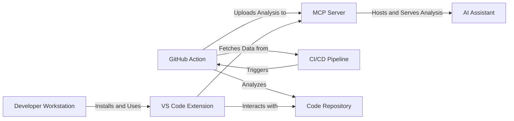

# Integration Patterns & Workflows

CodeBoarding integrates seamlessly into modern developer ecosystems through multiple supported methods, each tailored to different stages of the development lifecycle and various user needs. This guide explores the three primary integration methods — the VS Code extension, GitHub Action, and the MCP server integration — explaining their roles, benefits, and practical impacts on developer workflows and continuous delivery pipelines.

---

## Understanding CodeBoarding's Integration Methods

CodeBoarding is designed to fit naturally into your existing toolchain and CI/CD setup. Its integration options cater to both interactive developer experiences and automated continuous documentation generation, enabling ongoing, automated code comprehension, onboarding, and architectural insight.

### 1. VS Code Extension

**Purpose:** Provide developers with real-time, interactive code insights within their primary development environment.

**How it Works:**

- The extension hooks directly into Visual Studio Code, allowing developers to initiate analysis on-demand or automatically as they work.
- It presents interactive, AI-enhanced diagrams, summaries, and onboarding documentation inline or side-by-side with source code.
- This enables rapid comprehension of unfamiliar code segments, accelerates onboarding, and reduces context-switching.

**Workflow Impact:**

- Developers can explore codebase structure and design patterns instantly without leaving their editor.
- Enables continuous learning and understanding during coding sessions, improving productivity.
- Supports triaging or reviewing complex code changes by visualizing dependencies and component roles instantly.

**Practical Tip:**

Activate the extension in your workspace and configure auto-analysis triggers for relevant project folders. This setup ensures a continuous feedback loop as you navigate or modify code.

### 2. GitHub Action

**Purpose:** Automate code analysis and documentation generation within CI/CD pipelines to maintain up-to-date architectural insights in sync with code changes.

**How it Works:**

- Configured as part of your repository's GitHub workflow, it triggers on code pushes, pull requests, or scheduled intervals.
- The action clones the repository, runs CodeBoarding's CLI tools to analyze the current source state, and produces updated diagrams and onboarding documents.
- Results are then published as artifacts, committed back into the repository, or integrated with external reporting tools.

**Workflow Impact:**

- Ensures continuous alignment of architectural documentation with the latest codebase.
- Facilitates automated onboarding documentation updates without manual intervention.
- Integrates effortlessly with existing CI pipelines, requiring minimal configuration.

**Practical Tip:**

Customize the GitHub Action with environment variables to control analysis depth and output destinations. Use branch protections to enforce architectural reviews supported by up-to-date visual documentation.

### 3. MCP Server Integration

**Purpose:** Serve analysis results dynamically to AI-powered assistants or other clients for advanced code understanding and interactive querying.

**How it Works:**

- The MCP (Model-Centric Platform) Server acts as a persistent backend service that hosts CodeBoarding analysis outputs.
- It provides APIs enabling AI agents or IDE plugins to request and consume analysis data in real-time.
- Supports workflows where ongoing codebase understanding powers automated code review bots, onboarding assistants, or developer help chatbots.

**Workflow Impact:**

- Enables continuous, automated code understanding beyond static outputs.
- Powers AI assistants with updated, structured insights, helping teams scale onboarding and code reviews.
- Integrates into advanced developer tooling ecosystems where AI augments human decision-making.

**Practical Tip:**

Deploy the MCP server in your internal infrastructure and connect your AI assistants or developer tools to it for continuous, intelligent insights backed by CodeBoarding analysis.

---

## How CodeBoarding Fits Into Modern Developer Workflows

CodeBoarding acts as the connective tissue between source code, developer tools, and AI-based automation:

1. **Local Developer Flow:** Leveraging the VS Code extension, engineers get immediate context, improving code comprehension and reducing ramp-up times.
2. **Automated CI/CD Integration:** GitHub Actions ensure the entire team benefits from always-current architectural diagrams and onboarding documentation, supporting quality gatekeeping and architectural consistency.
3. **AI-Enabled Scalability:** Through the MCP server, CodeBoarding supports AI-based augmentation workflows, enabling smarter automation around code understanding, review, and onboarding.

This layered integration approach adapts to different scales and team maturity levels, from individual contributors needing instant context to enterprise-wide automated architectural governance.

---

## Visual Overview of CodeBoarding Integration Components

---

## Best Practices for Integration

- **Start with VS Code Extension for Rapid Feedback:** Enable developers to gain early value by providing interactive diagrams right inside their editor.
- **Automate With GitHub Action:** Add CI automation to keep documentation fresh as the code evolves without manual steps.
- **Extend with MCP Server for AI Workflows:** If your organization uses AI assistants or custom tooling, deploy the MCP server integration to unlock continuous and scalable automated understanding.
- **Configure Environment Variables Thoughtfully:** Control analysis scope, caching behaviors, and output formats to balance performance and detail according to your team’s needs.

---

## Troubleshooting Common Integration Issues

<AccordionGroup title="Common Issues & Solutions">
<Accordion title="VS Code Extension Doesn't Trigger Analysis">
- Ensure the extension is installed and enabled in the correct workspace.
- Verify configuration settings like `codeboarding.enableAutoAnalysis` are set.
- Restart VS Code to reload environment variables.
</Accordion>
<Accordion title="GitHub Action Fails to Run or Produces Errors">
- Check that all required secrets and environment variables (API keys, repository paths) are correctly configured.
- Confirm that the action has permissions to clone the repository.
- Review action logs for detailed error messages.
</Accordion>
<Accordion title="MCP Server Connection Issues">
- Verify that the MCP server is running and accessible from client tools.
- Check network settings and firewall rules.
- Confirm API keys or tokens are correctly provided to clients.
</Accordion>
</AccordionGroup>

---

## Next Steps

To implement the best integration strategy for your team, consult the following documentation:

- [Integrating CodeBoarding](https://www.codeboarding.org/docs/overview/features-integrations/integration-touchpoints) — Overview of all integration options with setup advice.
- [Working with Integrations](https://www.codeboarding.org/docs/guides/core-workflows/working-with-integrations) — Detailed workflows for VS Code and GitHub Action integration.
- [Orchestration Workflow](https://www.codeboarding.org/docs/concepts/core-architecture-overview/concept-integration-patterns) — Understand how these integrations fit into the internal analysis pipeline.

By embedding CodeBoarding via these patterns, your team will unlock continuous, up-to-date code understanding that lowers onboarding friction, supports architectural governance, and powers AI-augmented development workflows.

---

## Related Documentation

- [System Architecture Essentials](https://www.codeboarding.org/docs/concepts/core-architecture-overview/concept-architecture-essentials) — High-level system overview for context on integration.
- [Output Generator](https://www.codeboarding.org/docs/.codeboarding/Output_Generator.md) — Learn how analysis results are transformed for consumption.
- [AI Analysis Engine](https://www.codeboarding.org/docs/.codeboarding/AI_Analysis_Engine.md) — Explore the AI workflows behind the scenes.

---

[Try the Demo](https://www.codeboarding.org/demo) | [Community & Support](mailto:contact@codeboarding.org)
