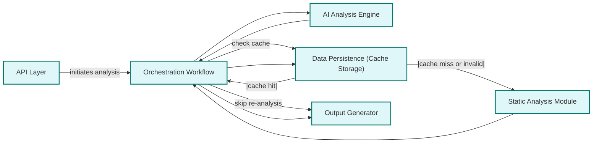

# Caching, Persistence, and Consistency

Explore how CodeBoarding balances analysis speed, data accuracy, and consistency through its caching and persistence strategies. This guide clarifies how cached analysis insights are stored, reused, and invalidated to enable efficient incremental codebase reviews while ensuring the documentation reflects the latest source code state.

---

## Introduction

Repeated codebase analysis can be resource-intensive, especially for large Python projects. CodeBoarding addresses this challenge by implementing a systematic caching model combined with persistence strategies that conserve computational effort without sacrificing output freshness or accuracy.

This page explains how CodeBoarding manages cached analysis data, determines when to reuse or invalidate caches, and maintains consistency across multiple runs to deliver reliable, up-to-date documentation and diagrams.

---

## Why Caching Matters

Imagine you're onboarding a new engineer: running a full analysis every time you generate updated documentation can cause significant delays and resource costs. Caching allows CodeBoarding to recognize unchanged portions of code and reuse prior computed insights, speeding up the analysis process.

The caching mechanism is designed to:

- **Accelerate repeated analyses** by avoiding redundant reprocessing of unmodified code.
- **Maintain output consistency** by ensuring cached data aligns correctly with the current state of the codebase.
- **Support incremental updates** that detect and analyze only differences when code changes.

---

## Overview of the Caching Model

At its core, CodeBoarding introduces an intelligent caching layer within the orchestration workflow that interacts closely with the Static Analysis Module, AI Analysis Engine, and Data Persistence components.

### Key Characteristics

- **Fine-grained Cache Entries:** Caching happens at the granularity of analysis nodes — such as files or code components — enabling selective cache reuse.
- **Metadata and Hash Checks:** The system compares code file hashes or timestamps to detect changes, deciding whether to invalidate related cache entries.
- **Integration with Persistence Layer:** Cache data is saved to and retrieved from the persistent storage (DuckDB-backed), ensuring durability across sessions.

<Info>
Caching can be enabled or disabled explicitly by setting the environment variable `CACHING_DOCUMENTATION`. When enabled, caching significantly reduces the time taken for repeated analysis runs.
</Info>

---

## How CodeBoarding Manages Cache and Persistence

### The Persistence Layer

CodeBoarding abstracts all storage and retrieval logic behind the **Data Persistence** component. It uses DuckDB (via SQLAlchemy) to efficiently manage large volumes of analysis artifacts, including cached static analysis metadata, intermediate AI-generated models, and final outputs.

This abstraction ensures that other components in the pipeline don’t need direct knowledge of the underlying database technology.

### Cache Workflow in Analysis

1. **Initial Analysis Run:**
   - No relevant cache exists.
   - Entire codebase is statically analyzed, and AI-driven models are generated.
   - Results are stored in the persistence layer as cache entries.

2. **Subsequent Analysis Runs:**
   - Before starting static analysis on a component, the orchestrator checks cached metadata.
   - If the component's source code hash matches the cached entry, its previously computed analysis is reused.
   - Otherwise, the component undergoes fresh static analysis and AI processing.

### Cache Invalidation

Cache invalidation is triggered automatically if:

- The content hash or timestamp of a code file or component differs from the stored cache record.
- The user explicitly disables caching via environment variables or configuration.
- Underlying dependencies or configurations impacting analysis have changed.

<Warning>
Inconsistent cache invalidation can lead to stale documentation. Always ensure the repository source code is fully synchronized and environment variables controlling caching are set correctly.
</Warning>

---

## User Control Over Caching

Users have explicit control over caching behavior through environment variables:

- **Enable Caching:**
  ```bash
  export CACHING_DOCUMENTATION=true
  ```

- **Disable Caching:**
  ```bash
  export CACHING_DOCUMENTATION=false
  ```

CodeBoarding's utility functions (e.g., `caching_enabled()` in the utils module) read these settings and activate the caching logic accordingly.

<Check>
Verify cache status during analysis by inspecting logs for cache hits/misses and checking timestamps on persisted entries.
</Check>

---

## Practical Workflow Scenario

Consider a developer running analysis after modifying only one source file in a large project:

1. The orchestration workflow begins the analysis.
2. It queries the persistence layer for cached metadata of all components.
3. For unchanged components, cached parsed graphs and AI insights are loaded, skipping costly recomputation.
4. For the modified file and dependent components, fresh static analysis and AI-driven modeling occur.
5. Updated results replace stale cached entries, maintaining overall consistency.
6. The output generator renders final documentation using the combined data.

This approach minimizes unnecessary computation while guaranteeing that changes flow through the system accurately and visibly.

---

## Common Pitfalls and Troubleshooting

### Cache Does Not Invalidate After Code Changes

- **Cause:** The system detects identical file hashing due to caching granularity or incorrect environment setup.
- **Resolution:** Confirm that the repository checkout is fresh. Manually clear cache directories if necessary. Ensure `CACHING_DOCUMENTATION` is properly set.

### Unexpected Stale Documentation

- **Cause:** Partial cache invalidation when underlying dependencies or configurations are updated but not detected.
- **Resolution:** Reset caches entirely or increase analysis depth to force full reanalysis.

### Performance Degradation Despite Caching

- **Cause:** Cache misses due to frequent changes or misconfigured caching.
- **Resolution:** Review caching logs, optimize analysis scope, and consider enabling incremental analysis modes if available.

<AccordionGroup title="Cache Troubleshooting Tips">
<Accordion title="How to Manually Clear Cache">
Delete the persistence storage files (e.g., DuckDB database files) from the output directory or cache folder.
</Accordion>
<Accordion title="Checking Cache Status in Logs">
Enable verbose logging to see messages indicating whether cache hits or misses occurred during analysis runs.
</Accordion>
<Accordion title="Modifying Cache Behavior via Environment Variables">
Adjust `CACHING_DOCUMENTATION` and validation settings as per your workflow and re-run analysis to observe effects.
</Accordion>
</AccordionGroup>

---

## Related Components and Documentation

In the broader CodeBoarding system, caching and persistence interplay closely with:

- **Orchestration Workflow:** Coordinates cache validation checks and triggers reanalysis as needed.
- **Static Analysis Module:** Supplies the raw code data to cache and retrieves cached results.
- **AI Analysis Engine:** Retrieves cached AI-generated models or requests regeneration.
- **Output Generator:** Relies on up-to-date cached models for documentation rendering.

For detailed system diagrams and understanding of how persistence fits within the entire analysis pipeline, see:

- [System Architecture Essentials](https://docs.codeboarding.org/concepts/core-architecture-overview/concept-architecture-essentials)
- [Orchestration Workflow](https://github.com/CodeBoarding/CodeBoarding/blob/main/.codeboarding/Orchestration_Workflow.md)
- [AI Analysis Engine](https://github.com/CodeBoarding/CodeBoarding/blob/main/.codeboarding/AI_Analysis_Engine.md)
- [Output Generator](https://github.com/CodeBoarding/CodeBoarding/blob/main/.codeboarding/Output_Generator.md)

---

## Visualization of Cache in System Flow



---

## Best Practices

- **Enable caching in development** to accelerate iterative analysis.
- **Manually clear or disable caching when upgrading CodeBoarding or changing core configurations.**
- **Monitor cache validity after significant codebase changes to prevent stale documentation.**
- **Use verbose logging for cache diagnostics during initial usage.**

---

## Summary

This page unveiled how CodeBoarding's caching and persistence mechanisms improve analysis efficiency by reusing valid cached data, while maintaining model and documentation accuracy through proactive cache invalidation techniques. Understanding these concepts empowers users to optimize analysis workflows, save time, and maintain up-to-date architectural documentation.

---

## Additional Resources

- [Core Architecture Essentials](https://docs.codeboarding.org/concepts/core-architecture-overview/concept-architecture-essentials)
- [Orchestration Workflow Documentation](https://github.com/CodeBoarding/CodeBoarding/blob/main/.codeboarding/Orchestration_Workflow.md)
- [AI Analysis Engine](https://github.com/CodeBoarding/CodeBoarding/blob/main/.codeboarding/AI_Analysis_Engine.md)
- [Output Generator](https://github.com/CodeBoarding/CodeBoarding/blob/main/.codeboarding/Output_Generator.md)
- [CLI and API Usage Guide](https://docs.codeboarding.org/guides/core-workflows/cli-and-api-usage)

---

## Related Environment Variable

- `CACHING_DOCUMENTATION`: Set to "true"/"false" to enable or disable caching.

---

## Contact and Support

If you encounter persistent caching issues, refer to the [Troubleshooting Installation & Configuration](https://docs.codeboarding.org/getting-started/troubleshooting-support/troubleshooting-install) guide or reach out to the community through official channels.

---