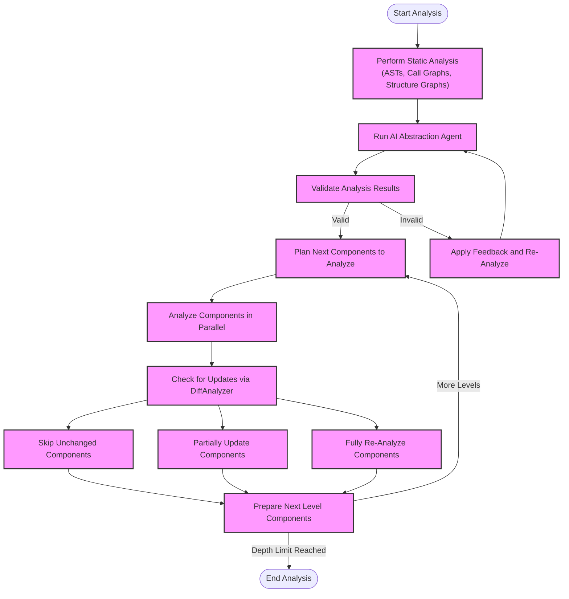
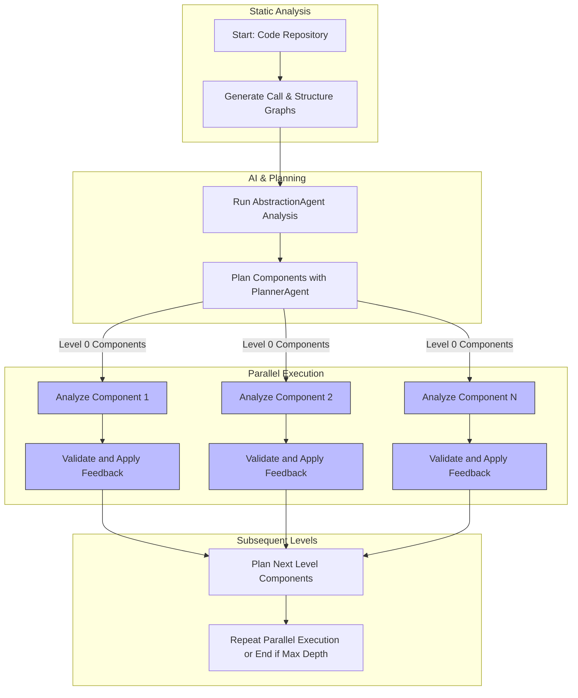

# Parallelism & Repository Scaling

CodeBoarding is designed to analyze large Python codebases rapidly and efficiently, even when they contain complex, multi-file repositories. This page explores how CodeBoarding achieves scalable analysis through parallel task execution, thoughtful process orchestration, and sophisticated update detection to avoid bottlenecks.

---

## Understanding the Challenge of Large Multi-File Repositories

Working with large multi-file repositories presents distinct challenges:

- **Sheer Volume:** Millions of lines of code spread across hundreds or thousands of files.
- **Complex Interdependencies:** Intricate call graphs and structural relationships that span modules and packages.
- **Performance Bottlenecks:** Sequential analysis can take excessive time, delaying feedback and onboarding.
- **Incremental Updates:** Reanalysing entire codebases for minor changes wastes resources.

CodeBoarding addresses these challenges through its core architectural strategies described below.

---

## Parallel Task Execution: Analyzing Components Concurrently

CodeBoarding breaks down the analysis workload into manageable components derived from the code structure. These components correspond to logical units such as modules or packages that can be analyzed independently at each depth level.

### Stepwise Parallel Processing Workflow

1. **Initial Static Analysis:** Generates the call graph and structure graph to understand the codebase layout.
2. **Component Planning:** The `PlannerAgent` identifies components for analysis at the current depth level.
3. **Concurrent Processing:** Components at each level are analyzed in parallel using a thread pool executor, with the number of workers capped (default max 8) to balance CPU usage and system stability.
4. **Recursive Expansion:** Based on findings, new components may be scheduled for next-level analysis until the configured depth is reached.

<Tip>
Parallelism is thoughtfully bounded to avoid thread contention and resource exhaustion, maximizing throughput without overwhelming your hardware.
</Tip>

This approach dramatically reduces analysis times in large codebases, leveraging multi-core processors effectively.

---

## Orchestration and Incremental Analysis

At the heart of the process lies the orchestration logic that manages how analysis tasks flow and how new insights trigger further analysis.

### Key Features:

- **Central Coordination:** The `DiagramGenerator` class orchestrates static analysis, AI-driven analysis, validation, and feedback application.

- **Diff Analysis & Caching:** The `DiffAnalyzingAgent` examines if components require re-analysis by comparing current code state against cached artifacts.

- **Update Degree Classification:** Components are classified based on their update degree:
  - **No Update (degree < 4):** Existing cached analysis is reused.
  - **Partial Update (4 <= degree < 8):** Feedback is applied for selective re-analysis.
  - **Full Update (degree >= 8):** Component is fully re-analyzed from scratch.

- **Validation Feedback Loop:** Analysis results are validated; if issues arise, the system applies feedback and re-analyzes components to refine outputs.

- **Progressive Depth Control:** Users configure `DIAGRAM_DEPTH_LEVEL` to set how many levels of component expansion occur.

<Warning>
Setting depth too high may lead to long runtimes on very large repositories; start with lower values and increase cautiously.
</Warning>

### Process Flow Illustration

---

## Managing System Resources and Throughput

### Worker Thread Limits

Analysis employs Python's `ThreadPoolExecutor` with `max_workers` set dynamically:

- Uses the lesser of CPU core count or 8 threads to avoid overhead from excessive concurrency.

### I/O and Disk Access

- Cached analysis files are read to prevent unnecessary recomputation.
- Writing analysis outputs is coordinated to prevent race conditions.

### Scalability Tips

- **Cache Enablement (`CACHING_DOCUMENTATION`):** Activating caching improves incremental analysis speed.
- **Depth Tuning (`DIAGRAM_DEPTH_LEVEL`):** Adjust depth considering trade-offs between detail and runtime.
- **Component Size:** Larger components may take longer; restructuring into smaller units improves parallelism.

<Check>
Monitor CPU and disk loads during analysis to ensure system health. Adjust concurrency parameters if needed.
</Check>

---

## Real-World Scenario: Incremental Update on a Large Repo

Imagine a Python monorepo of 1000 modules:

- A developer updates 3 modules.
- The diff analyzer quickly identifies only these modules as changed.
- Parallel analysis reprocesses just those, skipping 997 unchanged components.
- Associated downstream architectural models update accordingly.
- Results are saved for future runs, minimizing work on subsequent analyses.

This workflow empowers fast feedback loops, even for massive systems.

---

## Troubleshooting Common Performance Issues

<AccordionGroup title="Performance Troubleshooting">
<Accordion title="Analysis Runs Too Long">
- Confirm your `DIAGRAM_DEPTH_LEVEL` is appropriate; lower it to shorten runs.
- Check system CPU usage; consider reducing max parallel threads.
- Verify if caching is enabled to speed incremental runs.
- Review logs for repeated re-analysis of unchanged components.
</Accordion>
<Accordion title="Resource Exhaustion or Timeouts">
- Reduce concurrency settings.
- Increase system resources (CPU, memory).
- Use partial updates to analyze only targeted components.
- Review system logs for errors or interruptions.
</Accordion>
<Accordion title="Inconsistent or Missing Analysis Outputs">
- Ensure your repository clone is complete and error-free.
- Run a full clean analysis (delete cached files).
- Check for parse errors in Static Code Analyzer logs.
- Validate environment and configuration variables.
</Accordion>
</AccordionGroup>

---

## Summary

CodeBoarding’s approach to parallelism and repository scaling is grounded in intelligent task decomposition, effective concurrency, caching, and validation cycles. By orchestrating analysis in levels with dedicated updates detection and incremental work reuse, it enables users to gain timely, detailed insights into even the largest Python codebases. Adjusting depth and caching settings allows balancing between detail richness and performance to fit diverse project sizes.

---

## Related Documentation

- [System Architecture Overview](/overview/architecture-core-concepts/system-architecture-overview)
- [End-to-End Analysis Journey](/concepts/core-architecture-overview/concept-end-to-end-analysis-journey)
- [Static Analysis Model](/concepts/core-analysis-models/concept-static-analysis-model)
- [AI-Driven Abstraction & Component Modeling](/concepts/core-analysis-models/concept-ai-llm-analysis)
- [Tuning LLM Providers for Optimal Diagrams](/guides/best-practices/llm-tuning-diagrams)
- [Troubleshooting Installation & Configuration](/getting-started/troubleshooting-support/troubleshooting-install)

---

For full code references, see the `diagram_analysis/diagram_generator.py` and `agents/planner_agent.py` source files in the CodeBoarding repository.

---

## Visual Overview of Parallel Analysis Workflow

