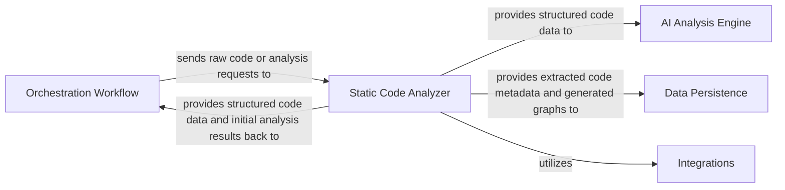

# Running Your First CodeBase Analysis

Welcome to your first step using CodeBoarding to analyze a Python codebase. This guide will walk you through running the initial CLI analysis script, help you understand the core workflow it executes, and show you where to find your result files. By the end, you will have performed your first successful codebase analysis and gained insight into the initial outputs.

---

## 1. Prerequisites Before Running Analysis

Before you start the analysis, ensure the following prerequisites are met:

- **Have CodeBoarding installed** on your system according to the installation guides.
- **Set up your environment** as detailed in the environment setup documentation, including activating your Python virtual environment.
- **Prepare your code repository**: have the target Python codebase available locally or accessible via a URL if remote fetching is configured.
- **Configure environment variables** including any AI LLM provider API keys if you plan to use AI features.

<Tip>
If you haven’t completed installation or environment setup yet, please refer to our [Installation (All Platforms)](/getting-started/setup-installation/installation-multi-platform) and [Configuration & Environment Variables](/getting-started/configuration-first-run/config-env-vars) guides.
</Tip>

---

## 2. Running the Initial CLI Analysis Script

The core entrypoint for your first analysis is the CLI script that triggers the static analysis and orchestrates the first stage of processing.

### Step-by-Step Instructions:

<Steps>
<Step title="Open your command line interface (Terminal/PowerShell)">Open the terminal or command prompt where CodeBoarding is installed and your environment is activated.</Step>
<Step title="Navigate to your project directory">Change directory to the root of the codebase you want to analyze using `cd /path/to/your/codebase`.</Step>
<Step title="Run the analysis script">Execute the CLI command:

```bash
codeboarding analyze --source . --output ./analysis_output
```

- `--source .` tells the tool to analyze the current directory.
- `--output ./analysis_output` sets the folder where results will be stored.
</Step>
<Step title="Wait for analysis to complete">The analysis may take a few minutes. The CLI will display progress logs indicating the orchestration, static analysis, and AI-driven processing stages.</Step>
<Step title="Verify output folder">After completion, ensure the directory `./analysis_output` exists and contains result files (JSON, Markdown, and diagrams).</Step>
</Steps>

### What happens during this script execution?

- The orchestration workflow ingests your source code and sends it to the **Static Code Analyzer**, which parses the code and builds foundational representations like Abstract Syntax Trees (ASTs), call graphs, and structure graphs.
- The static analysis results feed into the **AI Analysis Engine**, where specialized agents such as the PlannerAgent and AbstractionAgent interpret the data to infer architectural abstractions.
- All metadata and analysis artifacts are saved via the **Data Persistence** component.

<Info>
This initial run generates crucial structured data models of your codebase, which are the foundation for all subsequent diagram generation and documentation output.
</Info>

---

## 3. Understanding Your First Output Files

After running your first analysis, the `./analysis_output` directory will contain:

- **Static analysis data files**: JSON files containing ASTs, call graphs, and structure graphs.
- **AI analysis summaries**: JSON or Markdown reports where AI agents provide high-level architecture insights.
- **Interactive diagrams**: Generated Mermaid.js files that visually represent your codebase’s structure and component relationships.

### How to inspect these files:

- Open the Markdown reports in any Markdown viewer or editor.
- Use Mermaid-compatible tools or online editors (like [Mermaid Live Editor](https://mermaid.live/)) to visualize `.mmd` diagram files.
- Check JSON files for raw metadata or pass them to other tools for further processing.

<Tip>
For your first exploration, start by opening the main summary Markdown file — it includes explanations and links to the generated diagrams.
</Tip>

---

## 4. Troubleshooting Common Issues

<AccordionGroup title="Common Issues During First Analysis">
<Accordion title="No output generated or empty output folder">
Check that your CLI command was correct and that you have the necessary permissions to write to the output directory. Verify that source code path was accurate.
</Accordion>
<Accordion title="CLI reports dependency errors or missing modules">
Ensure all dependencies are installed. Run `pip install -r requirements.txt` within your activated environment. See installation docs for details.
</Accordion>
<Accordion title="Analysis is slow or stalls during processing">
Large repositories may take several minutes. Monitor logs for errors. Restart analysis if you suspect a hang. Consider analyzing a smaller subset first.
</Accordion>
<Accordion title="Environment variables for AI LLM missing or invalid">
Verify your API keys are correctly set in environment variables if running with AI features enabled. Check the configuration guide.
</Accordion>
</AccordionGroup>

If problems persist, consult the [Troubleshooting Installation & Configuration](/getting-started/troubleshooting-support/troubleshooting-install) page or reach out via the contact links.

---

## 5. Next Steps After First Analysis

Once you have successfully run your first codebase analysis and reviewed the outputs:

- Explore the generated interactive diagrams to understand module relationships.
- Experiment with customizing the analysis process via filters or config files.
- Integrate the analysis CLI into your continuous integration pipeline using GitHub Actions.
- Deep dive into AI-driven architectural insights using the documentation on [Core AI Engine](./AI_Analysis_Engine.md) and [Orchestration Workflow](./Orchestration_Workflow.md).
- Learn how to interpret and extend results in the [Interpreting Codeboarding Diagrams & Documentation](/guides/getting-started/understanding-diagrams) guide.

<Tip>
Continuing your journey with the [Quick Validation & Output Review](/getting-started/configuration-first-run/quick-validation) guide ensures your analysis results are correct and actionable.
</Tip>

---

## Diagram: How The Initial Analysis Flow Works



This overview illustrates the key components involved when you run your first analysis.

---

## References and Related Documentation

- [System Requirements & Prerequisites](/getting-started/setup-installation/prerequisites)
- [Installation (All Platforms)](/getting-started/setup-installation/installation-multi-platform)
- [Configuration & Environment Variables](/getting-started/configuration-first-run/config-env-vars)
- [Quick Validation & Output Review](/getting-started/configuration-first-run/quick-validation)
- [Troubleshooting Installation & Configuration](/getting-started/troubleshooting-support/troubleshooting-install)
- [Architecture Overview](./system-architecture-overview)
- [Static Code Analyzer Details](./Static_Code_Analyzer.md)
- [AI Analysis Engine Overview](./AI_Analysis_Engine.md)

---

Feel confident that this first operation unlocks the core value of CodeBoarding — powerful, AI-augmented insights into your Python codebase that set the foundation for faster onboarding, better documentation, and smarter architecture understanding.

Welcome aboard, and happy analyzing!
