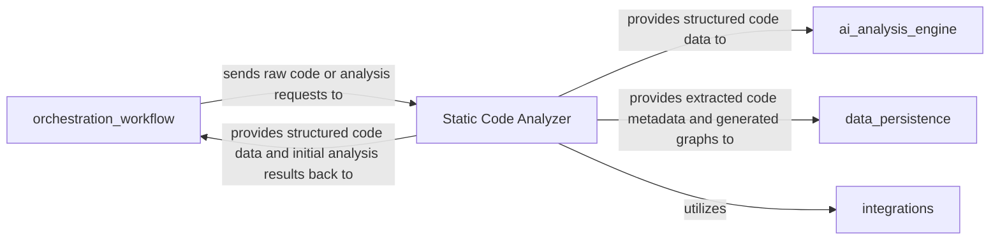

# Quick Validation & Output Review

Verify that your CodeBoarding installation and analysis processes have executed correctly by reviewing the generated output files and diagrams. This guide provides practical steps to confirm that your initial code analysis and documentation generation completed successfully.

---

## 1. Locate Your Output Directory

CodeBoarding outputs all analysis results, reports, and generated diagrams into a designated output directory specified during configuration or analysis run.

### Steps to find and confirm:

- Identify the output directory path used in your analysis configuration or command-line argument.
- Navigate to this output directory on your system.
- Confirm that it contains various result files and subfolders such as Markdown, HTML, Mermaid.js diagrams, and JSON metadata.

<Check>
Ensuring you are looking at the correct output directory is crucial. If unsure, recheck the `--output_dir` parameter or environment variable used during the analysis run.
</Check>

---

## 2. Review Generated Diagrams and Documentation

Your output directory should contain visual and textual representations of your codebase analysis. Follow these steps to quickly validate their presence and correctness:

### Steps:

1. Open the Markdown documentation files (usually with `.md` extension).
   - These files provide structured, human-readable insights about your analyzed codebase.
2. Look for diagram files typically in Mermaid.js format (`.mmd`, `.mermaid`, or embedded in `.md`).
   - Diagrams include call graphs, structure graphs, and high-level component models.
3. Open diagrams using compatible editors or tools supporting Mermaid.js, such as VS Code with Mermaid extensions or online Mermaid live editors.

### What to expect:

- **Call Graphs:** Visualize function/method call relationships detected by the Static Code Analyzer.
- **Structure Graphs:** Show architectural components and their hierarchy.
- **High-level Models:** AI-enhanced insights summarizing patterns and roles within the codebase.

<Info>
If diagrams do not display properly, verify your Mermaid.js rendering setup or open them in supported viewers.
</Info>

---

## 3. Verify Analysis Completion via Log or Status Files

During or after the analysis, CodeBoarding generates logs or status summary files.

### Steps:

- Check the output directory or the console logs for success messages indicating analysis completion.
- Look for files such as `analysis_status.json` or `run.log` that record execution details.
- Confirm no fatal errors or warnings related to parsing, AI processing, or file writing occurred.

<Warning>
If you detect errors, review your environment setup, input path correctness, and API key validity before rerunning the analysis.
</Warning>

---

## 4. Validate Key Output Artifacts

Certain core files are essential indicators of successful runs:

- **Abstract Syntax Trees (ASTs) and Call Graph JSON files:** Confirm static analysis succeeded.
- **AI-generated summaries and component models:** Confirm that AI agents processed data.
- **Final documentation files (Markdown, HTML):** Confirm output generation succeeded.

### How to validate:

- Open JSON files to check for plausible structured data (e.g., nested nodes).
- Read summary sections of documentation for meaningful insights rather than just placeholders.

---

## 5. Troubleshooting Common Issues

<AccordionGroup title="Common Quick Validation Issues and Fixes">
<Accordion title="No Output Files Found">
**Cause:** Incorrect output directory or permission issues.

**Fix:**
- Double-check the output directory path.
- Ensure write permissions.
- Rerun analysis with verbose logging.
</Accordion>

<Accordion title="Diagrams Fail to Render">
**Cause:** Mermaid.js not supported or improperly formatted diagrams.

**Fix:**
- Use Mermaid-compatible viewers.
- Validate diagram files syntax.
- Check for partial or corrupted diagram files.
</Accordion>

<Accordion title="Analysis Incomplete or Failed">
**Cause:** Errors in source parsing, network issues, or misconfiguration.

**Fix:**
- Review logs in the output directory.
- Confirm environment variables and API keys.
- Verify source code accessibility and integrity.
- Consult troubleshooting docs in the setup section.
</Accordion>
</AccordionGroup>

---

## 6. Next Steps

Once you confirm output validity:

- Explore the detailed documentation files to familiarize yourself with your codebase's analysis.
- Use the interactive diagrams for architectural comprehension and onboarding.
- Proceed to customize analysis parameters or integrate CodeBoarding into your CI/CD pipeline for continuous insights.

### Recommended documentation to consult next:

- [Running Your First CodeBase Analysis](/getting-started/configuration-first-run/first-analysis)
- [Understanding CodeBoarding Diagrams & Documentation](/guides/getting-started/understanding-diagrams)
- [Troubleshooting Installation & Configuration](/getting-started/troubleshooting-support/troubleshooting-install)

---

## Additional Resources

- [Static Code Analyzer Details](./Static_Code_Analyzer.md) - Learn how foundational code parsing and graph building operates.
- [AI Analysis Engine Overview](./AI_Analysis_Engine.md) - Understand the AI multi-agent system enhancing the analysis.
- [Orchestration Workflow](./Orchestration_Workflow.md) - Discover how analysis stages coordinate.

---

## Diagram: CodeBoarding Analysis Data Flow

This diagram represents the core interaction for code analysis and data generation you have just validated.

---

## Callout
<Tip>
Successful output review signals that CodeBoarding is installed and configured correctly and ready for deeper exploration and integration.
</Tip>

---

For additional support, visit the [Community & Support Resources](/getting-started/troubleshooting-support/community-links) or consult the [Troubleshooting Guide](/getting-started/troubleshooting-support/troubleshooting-install).

---

[Back to Configuration & First Run](/getting-started/configuration-first-run/config-env-vars) | [Next: Running Your First CodeBase Analysis](/getting-started/configuration-first-run/first-analysis)