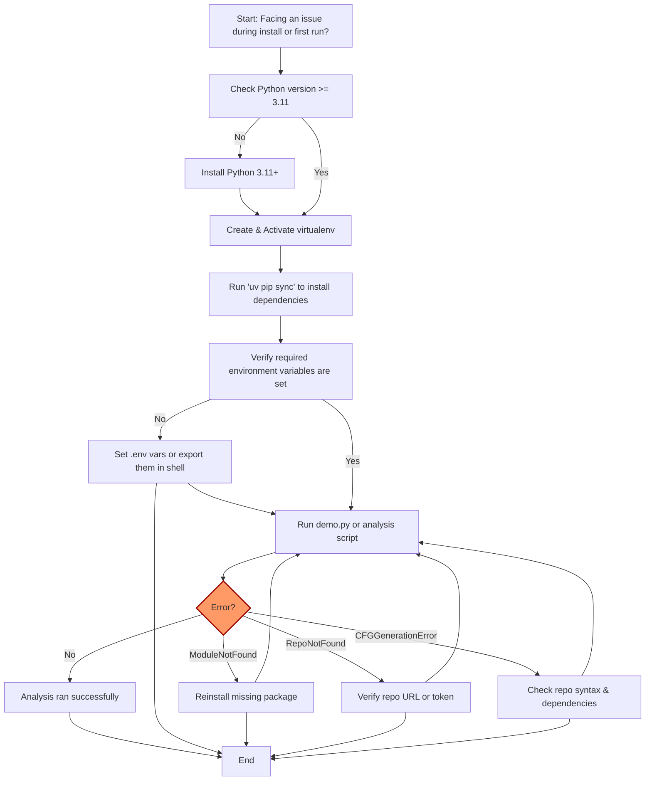

# Troubleshooting Installation & Configuration

This guide helps you identify and resolve common issues encountered during the setup, installation, and initial configuration of CodeBoarding. Following this troubleshooting workflow ensures you overcome blockers related to missing dependencies, environment variable misconfigurations, and typical error messages during the first run.

---

## 1. Common Setup Challenges & Their Solutions

### 1.1 Missing Dependencies

#### Symptoms:
- `ModuleNotFoundError` for libraries like `uv`, `fastapi`, `sqlalchemy`, or `langchain_core`
- Installation scripts fail midway

#### Resolution Steps:
1. Verify you have Python ≥ 3.11 installed.
2. Confirm you activated the virtual environment (see [Environment Setup](https://your-docs-domain/getting-started/setup-installation/environment-setup)).
3. Run the dependency synchronization command exactly as:

```bash
uv pip sync
```

4. If errors persist, manually install dependencies:

```bash
pip install -r requirements.txt
```

5. Check for errors related to OS-level libraries (e.g., `libpq-dev` for PostgreSQL clients) and install system packages accordingly.

### 1.2 Environment Variable Misconfiguration

#### Symptoms:
- Runtime errors about missing keys (e.g., `OPENAI_API_KEY` not set)
- CodeBoarding logs: `REPO_ROOT environment variable not set`

#### Resolution Steps:
1. Ensure you have a `.env` file or environment variables exported correctly.
2. Required core environment variables:

| Variable                  | Description                                      |
|---------------------------|------------------------------------------------|
| `OPENAI_API_KEY`          | API key for OpenAI if using that provider        |
| `ANTHROPIC_API_KEY`       | API key if using Anthropic                       |
| `GOOGLE_API_KEY`          | Google Gemini key if configured                  |
| `AWS_BEARER_TOKEN_BEDROCK`| AWS Bedrock token if used                        |
| `REPO_ROOT`               | Root directory for GitHub repo clones           |
| `ROOT_RESULT`             | Directory for storing analysis output           |
| `PROJECT_ROOT`            | Absolute path to your local CodeBoarding root   |
| `DIAGRAM_DEPTH_LEVEL`     | Integer depth for diagram generation (default: 1)|

3. Validate environment variables from your terminal:

```bash
# Linux/Mac
printenv OPENAI_API_KEY
```

```powershell
# Windows PowerShell
Get-ChildItem Env:OPENAI_API_KEY
```

4. You can temporarily set needed variables in shell:

```bash
export OPENAI_API_KEY="your_key_here"
export REPO_ROOT="./repos"
```

5. When in doubt, check that the `.env` file is placed at the project root and correctly loaded (CodeBoarding uses `python-dotenv`).

### 1.3 Common Error Messages

| Error Message                                    | Cause                                    | Solution                                        |
|-------------------------------------------------|------------------------------------------|------------------------------------------------|
| `Repository not found`                           | Invalid or inaccessible GitHub URL       | Verify URL, ensure public access or provide `GITHUB_TOKEN`|
| `Failed to generate diagram.`                    | CFG or static analysis error              | Check that the repo does not have unusual syntax or missing dependencies; rerun analysis|
| `Job not found`                                  | Query for an unknown job ID                | Confirm you are using the correct job identifier|
| `Internal server error`                          | Unexpected crashes or bugs                 | Review logs for traceback; report issues if persistent|

---

## 2. Step-by-Step Troubleshooting Workflow

Follow this flow to systematically identify and fix setup issues:

<Steps>
  <Step title="Verify Python Version and Environment">
    Run `python --version` to confirm Python 3.11 or higher is installed.
    Create and activate a virtual environment as per [Environment Setup](https://your-docs-domain/getting-started/setup-installation/environment-setup).
  </Step>

  <Step title="Install Dependencies">
    Run `uv pip sync` to install all required packages matching the repo's `pyproject.toml`/`requirements.txt`.
    If you encounter errors, install manually and investigate.
  </Step>

  <Step title="Confirm Environment Variables">
    Ensure all required variables are set locally or in `.env` and are accessible to your shell or running environment.
  </Step>

  <Step title="Run Initial Analysis with Logging">
    Execute a simple test analysis (e.g., `python demo.py https://github.com/adaptyvbio/ProteinFlow`).
    Tail your logs to watch for error messages or missing configurations.
  </Step>

  <Step title="Check Output Directories">
    Verify the output folders (default: `./results`) exist and have read/write permissions.
    Inspect output JSON and Markdown files to check if analysis completed.
  </Step>

  <Step title="Investigate Specific Errors">
    Refer to the error messages subsection above for guided solutions.
  </Step>

  <Step title="Use Debug Logs and Increase Verbosity">
    Set up logging more verbosely by configuring `logging_config.py`.
    Check log files for detailed tracebacks and clues.
  </Step>

  <Step title="Community Support and Bug Reporting">
    If stuck, consult the [Community & Support Resources](https://your-docs-domain/getting-started/troubleshooting-support/community-links).
    Provide logs and environment details when reporting.
  </Step>
</Steps>

---

## 3. Troubleshooting Examples

### Example: ModuleNotFoundError: uv

1. Confirm that you are in your virtual environment.
2. Run `pip install uv` or `uv pip sync` to synchronize dependencies.
3. Retry running the command.

### Example: REPO_ROOT environment variable not set

1. Open your `.env` or shell configuration.
2. Add `REPO_ROOT=./repos` (or your desired repo folder).
3. Restart your shell or reload environment variables.
4. Restart your CodeBoarding process.

### Example: Job fails with “Repository not found”

1. Verify the repo URL is valid and publicly accessible.
2. If it’s private, set the `GITHUB_TOKEN` in your environment.
3. Ensure network connectivity and firewall rules allow GitHub access.

---

## 4. Practical Tips & Best Practices

- Always use a dedicated Python 3.11 virtual environment to avoid package conflicts.
- Keep your environment variables secret and avoid committing them in public repos.
- Increase `DIAGRAM_DEPTH_LEVEL` cautiously, as higher depth may slow analysis and require more resources.
- Use the GitHub Action integration for CI/CD environments to avoid local setup complexities.
- Regularly update dependencies via `uv pip sync` to get the latest fixes and improvements.
- When encountering persistent unexplained errors, delete and recreate your virtual environment and temp folders.

---

## 5. Additional Resources

- [Configuration & Environment Variables](https://your-docs-domain/getting-started/configuration-first-run/config-env-vars)
- [System Requirements & Prerequisites](https://your-docs-domain/getting-started/setup-installation/prerequisites)
- [Running Your First CodeBase Analysis](https://your-docs-domain/getting-started/configuration-first-run/first-analysis)
- [Quick Validation & Output Review](https://your-docs-domain/getting-started/configuration-first-run/quick-validation)
- [Community & Support Resources](https://your-docs-domain/getting-started/troubleshooting-support/community-links)

---

> <Tip>
> If you encounter persistent issues, capturing logs (`codeboarding.log`) and sharing them with the community or maintainers will expedite resolution.
> </Tip>


---

## Troubleshooting Diagram



---