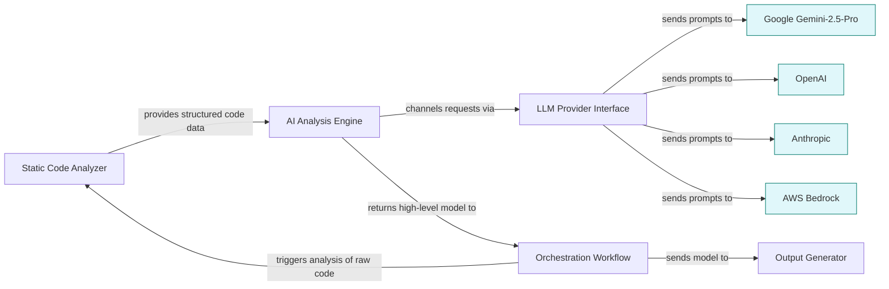

# Tuning LLM Providers for Optimal Diagrams

This guide helps you understand how to select and configure large language model (LLM) backends within CodeBoarding to generate accurate, detailed, and meaningful diagrams. It addresses the impact of different LLM providers on the quality of generated visualizations, provides practical recommendations for working with complex codebases, and offers troubleshooting tips to handle common challenges that occur during diagram generation.

---

## 1. Understanding the Role of LLM Providers in Diagram Generation

CodeBoarding leverages multiple LLM providers—including OpenAI, Anthropic, Google Gemini, and AWS Bedrock—to interpret static code analysis data and generate high-level architectural models and diagrams. These LLMs transform raw analysis graphs into comprehensive, interactive Mermaid.js diagrams that represent codebase structures and relationships clearly.

### Why Does LLM Choice Matter?
- Different LLM providers vary in their ability to handle complexity, interpret code semantics, and articulate abstractions.
- LLM capabilities directly affect the clarity, depth, and accuracy of diagrams produced.
- Provider API stability, latency, and cost considerations also impact your workflow efficiency.


## 2. Recommended LLM Provider Settings for Best Results

To maximize diagram generation quality, follow these provider-specific tips:

### 2.1 Google Gemini-2.5-Pro (Recommended for Complex Diagrams)

> Our experience shows that Google Gemini-2.5-Pro consistently delivers the best results for large, complex diagram generation tasks.

- Use this model when targeting in-depth architectural overviews or deeply nested module relationships.
- Expect sharper concept abstraction and more coherent component descriptions.
- Ensure your Google API key (`GOOGLE_API_KEY`) is correctly set in the environment variables.

### 2.2 OpenAI Models

- Good for general-purpose analysis and diagrams at moderate complexity.
- Use correct API key configuration (`OPENAI_API_KEY`) and set model parameters appropriate for your use case.
- You may need to tune prompt timeouts or retry logic if working with very large repositories.

### 2.3 Anthropic and AWS Bedrock

- Useful fallback options depending on availability and specific project needs.
- Verify API credentials (`ANTHROPIC_API_KEY`, `AWS_BEARER_TOKEN_BEDROCK`) and endpoint configurations.
- May require custom prompt tuning for best outcomes.


## 3. How to Configure Your Environment Variables

Set the appropriate environment variables before running analysis to enable your chosen LLM provider:

```bash
# Choose one LLM provider
OPENAI_API_KEY=your_openai_key_here
# or
ANTHROPIC_API_KEY=your_anthropic_key_here
# or
GOOGLE_API_KEY=your_google_key_here
# or
AWS_BEARER_TOKEN_BEDROCK=your_aws_token_here

# Core configuration
REPO_ROOT=./repos
ROOT_RESULT=./results
DIAGRAM_DEPTH_LEVEL=1
```

**Tip:** Set `DIAGRAM_DEPTH_LEVEL` higher to increase diagram detail but expect longer runtimes and possible LLM prompt length limitations.


## 4. Generating Diagrams with Optimal Settings

Follow these steps to produce high-quality diagrams:

<Steps>
<Step title="Step 1: Choose and configure your LLM provider">
Select the LLM provider best suited for your project complexity and configure the related API keys as environment variables.
</Step>
<Step title="Step 2: Set diagram depth level">
Configure `DIAGRAM_DEPTH_LEVEL` to control the level of detail in the generated diagrams. Start with `1` for high-level overviews, increase for more granularity.
</Step>
<Step title="Step 3: Run the analysis and diagram generation">
Execute the analysis command, for example:

```bash
python demo.py <github_repo_url> --output-dir <output_path>
```

This will run the static analysis, AI-driven modeling, and generate Mermaid.js diagrams in your output directory.
</Step>
<Step title="Step 4: Review generated diagrams and documentation">
Open the resulting Mermaid diagrams and Markdown/HTML documentation. Verify that the diagrams represent your codebase structure clearly and completely.
</Step>
</Steps>


## 5. Recommendations for Complex Diagram Generation

- Use **Google Gemini-2.5-Pro** whenever possible for best abstraction and coherence.
- Consider breaking extremely large repositories into smaller logical parts if diagrams become too complex or LLM calls time out.
- Enable caching (`CACHING_DOCUMENTATION=true`) to reduce repeated LLM calls for unchanged code components.
- Adjust `DIAGRAM_DEPTH_LEVEL` gradually; too high levels may cause overwhelming diagrams or LLM response failures.


## 6. Troubleshooting Common Issues

<AccordionGroup title="Troubleshooting LLM Diagram Generation">
<Accordion title="Diagrams are incomplete or missing components">
- Check whether your LLM API key is valid and environment variables are correctly set.
- Verify network connectivity to the LLM provider API.
- Reduce diagram depth level to simplify output and avoid LLM prompt length limits.
- Enable detailed logging (`logging_config.py`) to inspect the analysis pipeline.
</Accordion>
<Accordion title="LLM requests are timing out or failing">
- Confirm your API service quotas and rate limits.
- Retry the analysis with a smaller code subset or lower depth level.
- Check for transient network issues.
- Use an alternate LLM provider if available.
</Accordion>
<Accordion title="Diagram rendering looks cluttered or confusing">
- Simplify the diagram by lowering depth level.
- Use filtering options to hide less relevant components.
- Generate focused diagrams by partial component updates using the CLI flags.
</Accordion>
</AccordionGroup>


## 7. Best Practices & Tips

- Always keep your API keys secure and do not expose them in public configurations.
- Run initial analyses on smaller test repositories to validate your LLM setup before scaling up.
- Periodically update CodeBoarding and LLM providers to leverage improvements and bug fixes.
- Use the VS Code extension to interactively explore the diagrams and annotate insights.


## 8. Additional Resources and Next Steps

Once you have tuned your LLM provider settings and generated your diagrams:

- Explore [Analyzing Your First Repository](https://codeboarding.org/guides/getting-started/analyzing-first-repo) to deepen understanding.
- Review the [Customizing the Analysis Process](https://codeboarding.org/guides/core-workflows/customizing-analysis) guide to tweak analysis parameters.
- Use the [Integrating with IDEs and CI/CD](https://codeboarding.org/guides/core-workflows/working-with-integrations) guide for continuous diagram automation.
- Consult [Interpreting Codeboarding Diagrams & Documentation](https://codeboarding.org/guides/getting-started/understanding-diagrams) to extract the most value from outputs.


---

## Diagram: LLM Provider Integration Overview



---

# Appendix: Environment Variables Quick Reference

| Environment Variable            | Purpose                                           | Example Value                          |
| ------------------------------ | ------------------------------------------------ | ------------------------------------ |
| OPENAI_API_KEY                 | API key for OpenAI LLM provider                  | `sk-xxxxx`                           |
| ANTHROPIC_API_KEY              | API key for Anthropic LLM provider               | `api_key`                           |
| GOOGLE_API_KEY                 | API key for Google Gemini LLM                     | `AIzaSy...`                         |
| AWS_BEARER_TOKEN_BEDROCK       | Authentication token for AWS Bedrock LLM         | `token`                            |
| CACHING_DOCUMENTATION          | Enable caching of documentation for faster runs  | `true` or `false`                   |
| DIAGRAM_DEPTH_LEVEL            | Depth of diagram detail                            | `1` (default), higher for more detail|
| REPO_ROOT                     | Local directory path for cloned/analyzed repos   | `./repos`                          |
| ROOT_RESULT                   | Directory for output files                         | `./results`                       |

---

For additional help, visit the [CodeBoarding Documentation Home](https://github.com/CodeBoarding/CodeBoarding) or the [Community & Support Resources](https://codeboarding.org/getting-started/troubleshooting-support/community-links).


---

### Contact & Support

For questions or to report issues, please email contact@codeboarding.org or open a GitHub issue at the [CodeBoarding repository](https://github.com/CodeBoarding/CodeBoarding/issues).