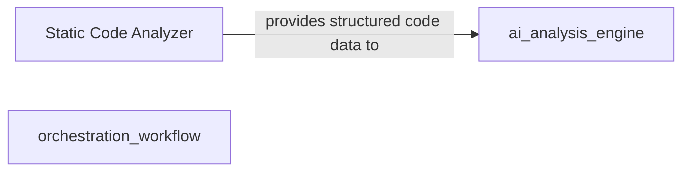
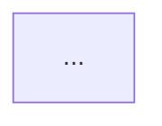

# Enhancing Documentation with Interactive Diagrams

Leverage CodeBoarding's powerful diagram generation capabilities to enrich your external documentation sites or developer portals. This guide helps you choose the right output formats, integrate interactive visuals seamlessly, and customize the user experience to maximize the clarity and value of your codebase insights.

---

## Workflow Overview

### What You Will Achieve

By following this guide, you will be able to:

- Select the appropriate output format (Markdown, HTML, or MDX) for embedding diagrams in your documentation environment.
- Integrate interactive Mermaid.js diagrams that visually represent your codebase architecture and analysis results.
- Customize diagram presentation and navigation to meet the needs of your developer audience.

### Prerequisites

- Completed static and AI-driven codebase analysis yielding structured output models.
- Access to the generated output files (Markdown, HTML, MDX) from the `Output Generator` component.
- Basic familiarity with your target documentation platform (e.g., GitHub Pages, Docusaurus, MDX-enabled frameworks).

### Expected Outcome

You will have a set of engaging, interactive architectural diagrams integrated into your external documentation, enhancing developer onboarding and comprehension.

### Time Estimate

15-30 minutes to set up basic integration and customize according to platform capabilities.

### Difficulty Level

Intermediate: Requires knowledge of documentation tooling and some familiarity with Mermaid.js and Markdown/HTML/MDX.

---

## Step-by-Step Instructions

### Step 1: Understand Output Formats Generated by CodeBoarding

CodeBoarding produces documentation outputs in several formats that contain Mermaid.js diagrams:

- **Markdown (.md)**: Standard Markdown files with embedded Mermaid diagrams and clickable links to expanded component details.
- **HTML (.html)**: Fully rendered static HTML documents including interactive Mermaid.js visualizations.
- **MDX (.mdx)**: React-flavored Markdown supporting JSX components, ideal for frameworks like Docusaurus or Gatsby that enable dynamic UI behavior.

Choose the format compatible with your documentation platform or mix formats for specialized use cases.

### Step 2: Locate Generated Output Files

After running your analysis using CodeBoarding's CLI or API, find the generated outputs in the specified output directory (`ROOT_RESULT` environment variable or CLI `--output-dir` argument).

Typical files include:

- `analysis.md` (Markdown overview with diagrams)
- `Output_Generator.html` (HTML output)
- `on_boarding.mdx` (MDX with frontmatter and diagrams)

Each file contains Mermaid.js diagrams representing the architecture and component relationships.

### Step 3: Embed Diagrams into Your Documentation

#### For Markdown-Based Docs:

- Directly include the generated `.md` files or copy Mermaid diagram blocks.
- Many modern Markdown renderers (e.g., GitHub, GitLab, MkDocs with Mermaid plugin) support rendering Mermaid code blocks.
- Use the clickable links embedded in the diagrams to allow readers to explore detailed component documentation.

#### For HTML Documentation:

- Integrate the generated `.html` files as standalone pages or embed the Mermaid diagram code into existing pages.
- Ensure your HTML environment includes Mermaid.js library initialization scripts if embedding diagrams manually.

#### For MDX-Enabled Platforms:

- Import or directly use the generated `.mdx` files.
- These allow seamless integration of interactive Mermaid diagrams along with React components for enhanced navigation.
- Customize frontmatter to fit your site’s metadata and theming.

### Step 4: Customize Diagram Appearance and Interaction

- Modify Mermaid.js diagram options in the generated source if needed (e.g., graph direction, node styles).
- Use external Mermaid configurations or CSS to harmonize diagrams with your documentation theme.
- Take advantage of clickable nodes and links embedded in the diagrams to provide a drill-down experience.

### Step 5: Publish and Validate

- Deploy your documentation including CodeBoarding outputs to your site or portal.
- Verify that diagrams render correctly, nodes link to details as expected, and navigation flows smoothly.
- Confirm that users can interact with diagrams (pan, zoom, click) corresponding to your platform’s Mermaid support.

---

## Practical Examples

### Example Mermaid Node and Edge from Markdown Output



This snippet shows how components and relationships are represented, with clickable nodes linking to detailed docs.

### Example MDX Frontmatter for Integration

```mdx
---
title: "Architecture Overview"
description: "Comprehensive architectural overview of the mcp-agent framework"
icon: "network"
---


```

This allows automatic metadata integration for static site generators.

---

## Troubleshooting & Tips

<AccordionGroup title="Common Issues When Integrating Diagrams">
<Accordion title="Diagrams Not Rendering in Markdown">
Ensure your documentation platform supports Mermaid rendering or enables Mermaid plugins. For GitHub, Mermaid support is limited; consider embedding generated HTML or MDX instead.
</Accordion>
<Accordion title="Clickable Links Not Working">
Verify that the hyperlinks in Mermaid diagrams correctly match your deployed documentation file paths and that relative links resolve properly.
</Accordion>
<Accordion title="Diagram Styling Conflicts">
Override Mermaid CSS or use isolated containers to prevent style clashes with your documentation site's theme.
</Accordion>
</AccordionGroup>

<Tip>
For best visuals in complex codebases, use MDX output with a Mermaid-enabled React framework to gain dynamic interactivity.
</Tip>

<Warning>
Avoid manually modifying Mermaid diagrams beyond layout unless you are confident; regenerate outputs to reflect changes properly.
</Warning>

---

## Next Steps & Related Content

- Explore the **System Architecture Overview** and **Output Generator** component documentation for deeper understanding of source data and rendering capabilities.
- Use the **Integrating CodeBoarding** guide for connecting outputs to VS Code or CI/CD pipelines.
- Review **Tuning LLM Providers for Optimal Diagrams** to enhance analysis quality for clearer visualizations.
- Consult the **Getting Started > Interpreting Codeboarding Diagrams & Documentation** guide for detailed diagram reading strategies.


---

## References

- [System Architecture Overview](https://github.com/CodeBoarding/CodeBoarding/blob/main/.codeboarding/architecture.md)
- [Output Generator Documentation](https://github.com/CodeBoarding/CodeBoarding/blob/main/.codeboarding/Output_Generator.md)
- [Integrating CodeBoarding](https://codeboarding.org/overview/features-integrations/integration-touchpoints)
- [Mermaid.js Official Documentation](https://mermaid.js.org/)


---

> By effectively embedding and customizing interactive diagrams, you transform complex, multi-layered code analysis into accessible knowledge. This empowers your teams to onboard faster, maintain clearer mental models, and collaborate with confidence.