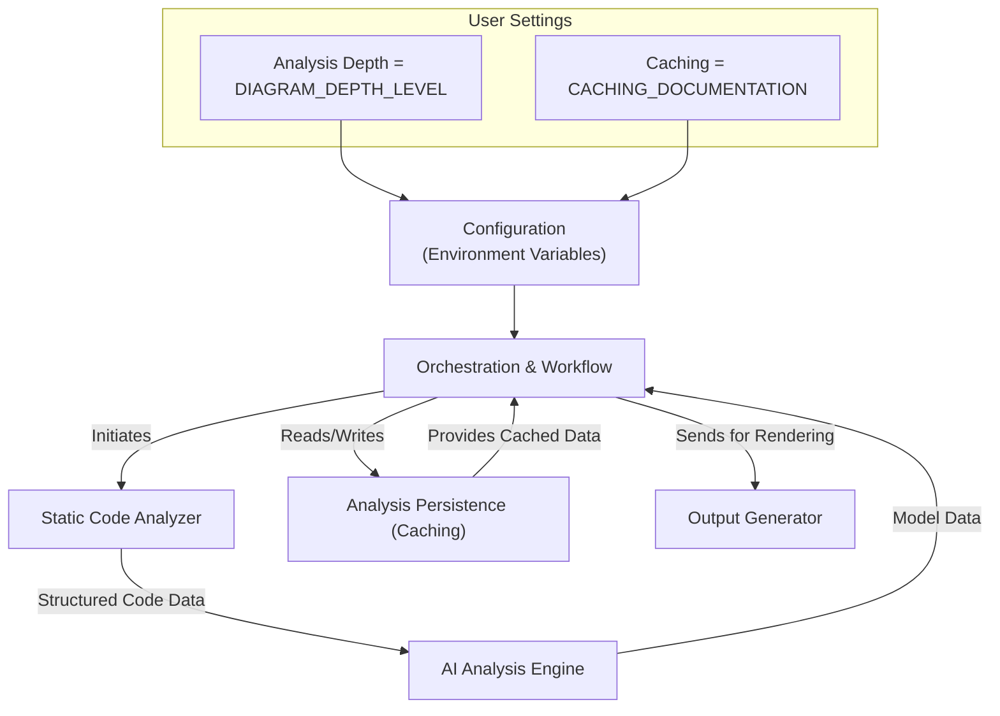

# Customizing the Analysis Process

Welcome to the guide on customizing CodeBoarding's analysis process. This page focuses on how to configure key parameters such as analysis depth, caching, and core settings to tailor the output to your project's size and complexity. By mastering these configurations, you'll optimize performance and shape the detail level of generated diagrams and documentation.

---

## 1. Understanding Your Customization Options

CodeBoarding allows you to adapt the analysis pipeline to your needs through configurable parameters that influence:

- **Analysis Depth** — How detailed the codebase breakdown and diagrams are.
- **Caching Behavior** — Whether or not to reuse previously generated data for faster incremental runs.
- **Core Parameters** — Essential environment variables that govern repo locations, output directories, and LLM provider settings.

These options help you balance thoroughness with performance, enabling smooth onboarding for projects ranging from small scripts to large, complex systems.


### Prerequisites

Before diving into configuration, ensure you have:
- A working CodeBoarding installation with dependencies set up (see [Environment Setup](../../getting-started/setup-installation/environment-setup)).
- Your target Python codebase accessible locally or remotely.
- Proper LLM API keys configured for AI analysis tasks.


### Expected Outcome

After following this guide, you will confidently control:
- The granularity of your analysis results.
- How caching accelerates repeated runs.
- The environment and directory structure that CodeBoarding uses.


### Time Estimate

Configuring and running adjusted analysis runs typically takes 10-20 minutes, depending on project size.


### Difficulty Level

Intermediate: You should be comfortable editing environment variables and running terminal commands.


---

## 2. Step-by-Step Configuration Guide

### Step 1: Set the Analysis Depth

The analysis depth controls how deeply CodeBoarding inspects and abstracts your codebase.

- **Parameter:** `DIAGRAM_DEPTH_LEVEL`
- **Location:** Set as an environment variable or within your project’s `.env` or shell configuration.

**Action:**

```bash
export DIAGRAM_DEPTH_LEVEL=1  # Levels: 1 (shallow) to 3 (deep)
```

- Level 1: High-level overview, faster generation.
- Level 2: Moderate detail with more components.
- Level 3: Deep dive with exhaustive coverage.

**Expected Result:** When running analysis, the output diagrams will reflect the chosen abstraction level.


### Step 2: Enable or Disable Caching for Documentation

Caching stores analysis results to expedite future runs, especially beneficial for large projects or iterative analysis.

- **Parameter:** `CACHING_DOCUMENTATION`
- **Type:** Boolean (`true` or `false`)

**Action:**

```bash
export CACHING_DOCUMENTATION=true
```

- **true**: Cache results to avoid redundant processing.
- **false**: Always reanalyze from scratch.

**Tip:** Enable caching during active development to speed up incremental analyses.


### Step 3: Configure Core Paths and Keys

Ensure the following environment variables point to correct locations and keys:

| Variable                | Purpose                                | Example Value                      |
|-------------------------|--------------------------------------|----------------------------------|
| `REPO_ROOT`             | Directory where repositories are cloned/downloaded | `./repos`                       |
| `ROOT_RESULT`           | Destination for analysis outputs      | `./results`                      |
| `PROJECT_ROOT`          | Local path to the root of your project | `/path/to/MyProject`              |
| LLM API Keys (e.g., `OPENAI_API_KEY`) | Credentials for AI providers         | `sk-...`                        |

**Action:**

```bash
export REPO_ROOT=./repos
export ROOT_RESULT=./results
export PROJECT_ROOT=/home/user/projects/MyProject
export OPENAI_API_KEY=sk-xxxxxxxxxxxxxxxx
```

**Expected Result:** CodeBoarding has access to your source code and can output results correctly while authenticating AI calls.


### Step 4: Run the Analysis with Your Settings

Use the demo script or CLI with your customized environment variables in place.

Example command:

```bash
python demo.py https://github.com/your/repo --output-dir ./results
```

If you wish to update only specific components or partial analysis, you can leverage the advanced options available in scripts like `vscode_runnable.py` (refer to code comments and script parameters).


### Step 5: Verify and Interpret Results

- Check the output directory for updated diagrams and documentation.
- Confirm the analysis depth matches expectation by examining generated Mermaid.js diagrams for component detail.
- Review logs for any warnings related to caching or analysis depth settings.


---

## 3. Practical Examples

### Example 1: Shallow Analysis for Quick Overview

Configure for a low depth level with caching enabled to rapidly generate a top-level diagram:

```bash
export DIAGRAM_DEPTH_LEVEL=1
export CACHING_DOCUMENTATION=true
python demo.py https://github.com/CodeBoarding/CodeBoarding --output-dir ./results
```

You will get a fast output showing major modules and their relationships.


### Example 2: Deep Dive Without Caching

For a comprehensive, clean analysis with no cached data:

```bash
export DIAGRAM_DEPTH_LEVEL=3
export CACHING_DOCUMENTATION=false
python demo.py https://github.com/CodeBoarding/CodeBoarding --output-dir ./results
```

Expect longer runtime but deeper insights — useful after major codebase changes.


---

## 4. Troubleshooting & Best Practices

<AccordionGroup title="Common Issues and Solutions">
<Accordion title="Analysis Depth Too High Causes Slow Performance">
Try reducing `DIAGRAM_DEPTH_LEVEL` to 1 or 2 to speed up.

Review logs for memory or timeout errors.
</Accordion>

<Accordion title="Caching Seems Not Working or Causes Stale Output">
Ensure `CACHING_DOCUMENTATION` is set correctly.

Manually delete cache folders under the output directory to reset.
</Accordion>

<Accordion title="LLM API Authentication Failures">
Verify your API keys are set in environment variables and valid.
Check for network connectivity issues.
</Accordion>

<Accordion title="Output Diagrams Missing Details">
Check that the analysis completed successfully without errors.
Increase depth level if needed.
</Accordion>
</AccordionGroup>


### Best Practices

- Use caching when iterating rapidly to save time.
- Adjust depth level according to the scale of your codebase.
- Always verify environment variables before running analysis.
- Combine partial updates for large projects to analyze incrementally (see advanced usage).


---

## 5. Next Steps & Related Guides

- [Running Your First CodeBase Analysis](../../getting-started/configuration-first-run/first-analysis) — Get started with initial runs.
- [Interpreting Codeboarding Diagrams & Documentation](../../guides/getting-started/understanding-diagrams) — Understand your outputs better.
- [Using the CLI and HTTP API](./cli-and-api-usage) — Advanced integration options.
- [Tuning LLM Providers for Optimal Diagrams](../../guides/best-practices/llm-tuning-diagrams) — Enhance AI results.

---

Feel empowered to tailor CodeBoarding to your workflow. Mastering these settings enables efficient, insightful codebase comprehension and accelerates developer onboarding.

---

## Visual Overview

Below is a high-level diagram depicting where customization fits in the overall analysis process:



---

## References

- [CodeBoarding GitHub Repository](https://github.com/CodeBoarding/CodeBoarding)
- [Environment Setup Guide](../../getting-started/setup-installation/environment-setup)
- [Orchestration & Workflow Documentation](../../concepts/core-architecture-overview/concept-architecture-essentials#orchestration-workflow)


---

&lt;Check&gt;
Remember, successful customization relies on accurate environment configuration and understanding how depth and caching impact your project. Experiment in small steps and review results carefully.
&lt;/Check&gt;
