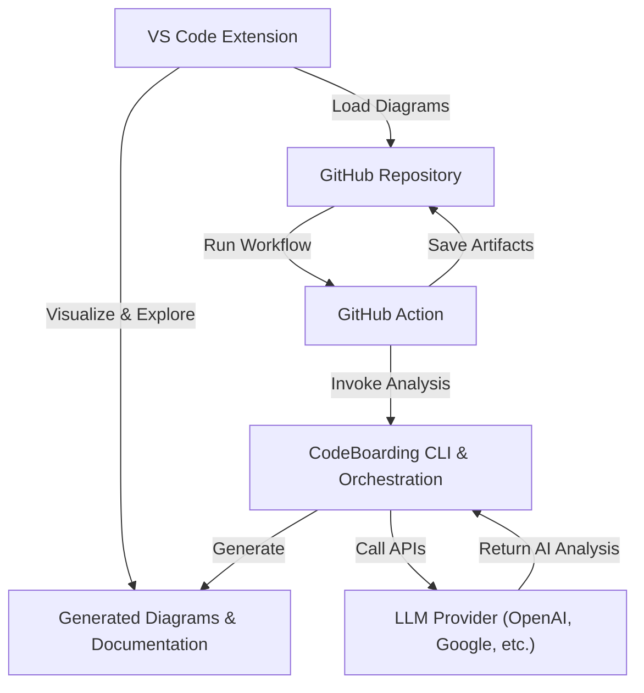

# Integrating with IDEs and CI/CD

This guide provides practical, step-by-step instructions to leverage the CodeBoarding VS Code extension and GitHub Action for automating codebase diagram generation and documentation. By following this guide, you will integrate CodeBoarding into your development workflows to maximize productivity and ensure continuous onboarding coverage.

---

## 1. Overview

### What This Guide Covers
- Setting up the CodeBoarding **VS Code Extension** for interactive codebase visualization within your IDE.
- Configuring the **GitHub Action** to automate diagram and documentation generation as part of your CI/CD pipeline.
- Best practices for workflow integration and maximizing the value of continuous documentation.

### Prerequisites
- You must have CodeBoarding installed and configured with appropriate environment variables, including your LLM API keys.
- Access to the repository where you want to enable integrations.
- Familiarity with basic GitHub workflows and VS Code usage.

### Expected Outcomes
- Ability to visualize and interact with generated diagrams directly inside VS Code.
- Automated, consistent generation of updated documentation triggered by your GitHub workflows.
- Enhanced onboarding experience through continually refreshed codebase visualizations.

### Time Estimate
Expect to spend approximately 20-30 minutes setting up and testing both integrations.

### Difficulty Level
Intermediate — requires some familiarity with IDE extensions and GitHub workflows.

---

## 2. Setting Up the VS Code Extension

The CodeBoarding VS Code extension provides an interactive layer inside your IDE, enabling you to visualize and explore your codebase's high-level architectural diagrams generated by CodeBoarding.

### Step 1: Install the Extension
1. Open VS Code.
2. Go to the Extensions view (⇧⌘X on Mac, Ctrl+Shift+X on Windows/Linux).
3. Search for `CodeBoarding.codeboarding`.
4. Click **Install**.


### Step 2: Connect to Your Project
1. Open your project folder inside VS Code.
2. Locate the CodeBoarding sidebar tab.
3. Use the extension commands to run an analysis or load existing CodeBoarding outputs.


### Expected Result
- You should see interactive Mermaid.js diagrams representing your codebase.
- You can navigate between modules, drill down into components, and access generated documentation.


### Best Practices
- Regularly invoke the analysis after significant code changes to keep diagrams up to date.
- Use the extension's filtering and search capabilities to focus on relevant parts of your project.


### Troubleshooting
- If diagrams do not render, ensure your output directory contains up-to-date Mermaid diagram files.
- Verify your environment variables for LLM API keys are correctly set in your VS Code environment.

---

## 3. Configuring the GitHub Action for CI/CD

Automate the generation of up-to-date architectural diagrams and documentation by integrating the CodeBoarding GitHub Action into your repository's workflows.

### Step 1: Add the GitHub Action Workflow
1. In your repository, create a file at `.github/workflows/codeboarding.yml`.
2. Insert the following example configuration:

```yaml
name: CodeBoarding Analysis

on:
  push:
    branches:
      - main
  pull_request:
    branches:
      - main

jobs:
  codeboarding:
    runs-on: ubuntu-latest
    steps:
      - name: Checkout repository
        uses: actions/checkout@v3

      - name: Set up Python 3.11
        uses: actions/setup-python@v4
        with:
          python-version: 3.11

      - name: Install dependencies
        run: |
          python -m pip install --upgrade pip
          pip install -r requirements.txt

      - name: Run CodeBoarding analysis
        uses: Codeboarding/codeboarding-diagram-first-documentation@v1
        with:
          github_token: ${{ secrets.GITHUB_TOKEN }}

```


### Step 2: Configure Secrets
- Go to your GitHub repository's **Settings > Secrets and variables > Actions**.
- Add API keys required by your LLM provider (e.g., `OPENAI_API_KEY`, `GOOGLE_API_KEY`, etc.) as repository secrets, matching your local environment variables.


### Step 3: Customize Parameters (Optional)
- You can set inputs like the `output-dir` or `diagram-depth-level` per your project needs by editing the action configuration.
- Consult the GitHub Marketplace page for available inputs: [CodeBoarding GitHub Action](https://github.com/marketplace/actions/codeboarding-diagram-first-documentation).


### Expected Result
- On every push or pull request to the `main` branch, the action runs.
- It analyzes the repository code, generates or updates interactive diagrams and documentation.
- Results are stored as artifacts or updated in your repository based on your workflow customization.


### Best Practices
- Trigger analysis on branches that reflect production or important development stages.
- Use caching to reduce runtime by enabling documentation caching in your environment variables.


### Troubleshooting
- If the action fails, check logs for missing API keys or permission errors.
- Ensure that your Python environment and dependencies are correctly specified and installed.

---

## 4. Workflow Integration Tips to Maximize Productivity

To fully leverage the integrations, consider these best practices:

- **Sync with CI/CD:** Use the GitHub Action to keep your static analysis and diagrams always current. Combined with the VS Code extension, this delivers real-time insights and historical tracking.

- **Documentation as Code:** Commit generated documentation and diagrams as part of your repository for full versioning and audit trails.

- **Collaborative Onboarding:** Share active diagrams through VS Code Live Share or embed diagrams in pull requests for peer reviews.

- **Environment Consistency:** Maintain a `.env.example` with all required variables and prompt team members to configure their development environments accordingly.

- **Customize Diagram Depth:** Adjust `DIAGRAM_DEPTH_LEVEL` in your environment or workflow to balance detail and performance.

---

## 5. Summary Diagram of Integration Workflow



---

## 6. Troubleshooting & Common Pitfalls

| Issue | Cause | Solution |
| --- | --- | --- |
| Diagrams not rendering in VS Code | Output files missing or stale | Ensure recent analysis run; verify output directory path in extension settings |
| GitHub Action fails due to missing API keys | Secrets not configured | Add required LLM API keys as GitHub Secrets matching environment variable names |
| Long runtime in CI/CD | Large project or deep diagram level | Lower `DIAGRAM_DEPTH_LEVEL`, enable `CACHING_DOCUMENTATION` to speed up incremental runs |
| API rate limits or errors | Exceeded provider limits or no key | Monitor usage; use preferred LLM with highest rate limits; validate API keys configured |

<Tip>
Keep your CodeBoarding environment variables synchronized between your local and CI/CD environments to ensure consistency in generated results.
</Tip>

---

## 7. Next Steps & Related Resources

- **Run Your First Analysis:** See [Running Your First CodeBase Analysis](https://your-documentation-url/guides/getting-started/analyzing-first-repo).
- **Customize Your Analysis:** Learn how to modify depth and caching in [Customizing the Analysis Process](https://your-documentation-url/guides/core-workflows/customizing-analysis).
- **Explore Architecture:** Understand internal architecture in [System Architecture Overview](https://your-documentation-url/overview/architecture-core-concepts/system-architecture-overview).
- **Troubleshoot Issues:** Visit [Troubleshooting Installation & Configuration](https://your-documentation-url/getting-started/troubleshooting-support/troubleshooting-install).
- **Community & Support:** Engage via [Community & Support Resources](https://your-documentation-url/getting-started/troubleshooting-support/community-links).

---

For deeper insights about integrations and triggering analysis through different means, consult the [Integration Touchpoints](https://your-documentation-url/overview/features-integrations/integration-touchpoints) page.


---

*This documentation section empowers you to embed CodeBoarding seamlessly into your daily development workflow, ensuring your codebase documentation stays fresh, accessible, and actionable for your team and AI agents alike.*

---


