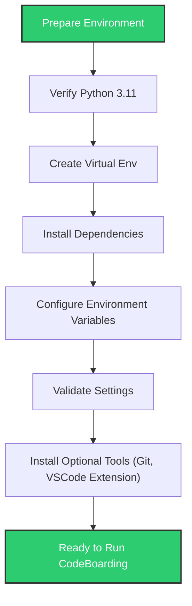

# Installation & Environment Setup

Welcome to the first step in making CodeBoarding ready to analyze your Python codebases efficiently and reliably. This guide leads you through preparing your environment, configuring essential settings like LLM API keys and directory paths, and installing CodeBoarding tools so you can confidently run analysis on any Python project.

---

## 1. Overview

### What You'll Achieve
By following this guide, you'll have a fully prepared environment configured for CodeBoarding's powerful static analysis and AI-driven diagram generation capabilities. This includes setting up your Python environment, installing required dependencies, and configuring environment variables crucial for smooth operation.

### Prerequisites
- Basic knowledge of terminal/command prompt usage
- Access to the internet for package downloads and API key verification
- A GitHub account for cloning repositories and optionally generating analysis via GitHub Actions

### Estimated Time
About 15-30 minutes, depending on your system and network speed.

### Difficulty Level
Beginner to Intermediate

---

## 2. Prepare Your Environment

### Step 1: Verify System Requirements
Ensure your system meets the following mandatory requirements:
- Python 3.11 installed and accessible from your command line
- Supported Operating System: Windows, macOS, or Linux
- Network access to external APIs for AI provider calls

### Step 2: Set Up Python Virtual Environment
Creating an isolated Python environment prevents dependency conflicts.

```bash
python3.11 -m venv venv
source venv/bin/activate  # macOS/Linux
venv\Scripts\activate   # Windows
```

### Step 3: Install Required Packages
Use the `uv` utility (recommended) to synchronize dependencies:

```bash
uv pip sync
```

This installs all dependencies specified for CodeBoarding, ensuring compatibility.

<Tip>
If you do not have `uv` installed, install it via `pip install uv` or manually run `pip install -r requirements.txt`.
</Tip>

### Step 4: Confirm Installation
Run the following to verify CodeBoarding components are ready:

```bash
python demo.py --help
```

You should see detailed usage information.

---

## 3. Configure Core Environment Variables

Correct environment variable setup is essential for API access and locating your repositories.

### Required Variables
Set the following variables in your shell or `.env` file:

| Variable               | Purpose                                      | Example                              |
|------------------------|----------------------------------------------|------------------------------------|
| `OPENAI_API_KEY`       | OpenAI LLM API key (if using OpenAI)         | `sk-...`                           |
| `ANTHROPIC_API_KEY`    | Anthropic LLM API key (alternative provider) | `sk-...`                           |
| `GOOGLE_API_KEY`       | Google Gemini LLM API key                     | `AIza...`                         |
| `AWS_BEARER_TOKEN_BEDROCK` | AWS Bedrock API token                   | `token_string`                    |
| `REPO_ROOT`            | Directory path to store cloned repositories  | `./repos`                         |
| `ROOT_RESULT`           | Output directory for generated onboarding docs | `./results`                     |
| `PROJECT_ROOT`         | Root path of your source project to analyze  | `/path/to/CodeBoarding`           |
| `DIAGRAM_DEPTH_LEVEL`  | Max depth for generated diagrams              | `1`                              |

<Tip>
You only need to set one API key for your preferred LLM provider. If multiple are set, OpenAI is prioritized, then Anthropic, Google, and AWS Bedrock.
</Tip>

### Step 5: Sample `.env` File

```
OPENAI_API_KEY=sk-xxxxxxxxxxxxxx
REPO_ROOT=./repos
ROOT_RESULT=./results
PROJECT_ROOT=/Users/yourname/CodeBoarding
DIAGRAM_DEPTH_LEVEL=1
```

### Validate Environment Variables
Verify your variables are set:

```bash
echo $OPENAI_API_KEY
echo $REPO_ROOT
```

---

## 4. Optional: Install Additional Tools

CodeBoarding works seamlessly with:
- Git (to clone repositories)
- VS Code Extension (for interactive diagrams inside the IDE)

Install Git if you haven't already:

```bash
git --version
# If not installed, visit https://git-scm.com/downloads
```

Install the [CodeBoarding VS Code Extension](https://marketplace.visualstudio.com/items?itemName=Codeboarding.codeboarding) via VS Code Marketplace to enhance your workflow.

---

## 5. Running Your First Analysis (Preview)

With environment setup complete, you can run an analysis on a repository using the CLI:

```bash
python demo.py https://github.com/user/example-repo --output-dir ./output_docs
```

This command clones the repo, generates diagrams and documentation by default in markdown, and writes output to the specified directory.

For detailed instructions, see the [Running Your First CodeBase Analysis](https://example.com/guides/getting-started/analyzing-first-repo) guide.

---

## 6. Troubleshooting Common Setup Issues

<AccordionGroup title="Common Setup Issues and Solutions">
<Accordion title="Python Version Problems">
Ensure Python 3.11 is installed and the `python` command targets Python 3.11. Use `python3` or adjust your PATH if necessary.
</Accordion>
<Accordion title="Missing API Keys">
Verify your `.env` file is loaded correctly, and API keys are set. The application logs will indicate if no valid key is found.
</Accordion>
<Accordion title="Network Connectivity">
The tool requires internet access for AI API calls and cloning Git repos. Check your firewall and proxy settings.
</Accordion>
<Accordion title="Dependency Installation Errors">
Ensure your package manager (`pip`/`uv`) is up to date. Try upgrading pip with `pip install --upgrade pip`.
</Accordion>
<Accordion title="Permission Issues on Directories">
Make sure you have write permissions to the `REPO_ROOT` and `ROOT_RESULT` directories.
</Accordion>
</AccordionGroup>

---

## 7. Best Practices

- Store your API keys securely and do not commit `.env` files with secrets to public repos.
- Use virtual environments to isolate CodeBoarding dependencies from other Python projects.
- Regularly update CodeBoarding and dependencies to benefit from fixes and improvements.
- Start with `DIAGRAM_DEPTH_LEVEL=1` for faster results; increase as needed for deeper analysis.

---

## 8. Summary Diagram of Setup Flow



---

## 9. Next Steps

Once your environment is set up:
- Proceed to [Running Your First CodeBase Analysis](https://example.com/guides/getting-started/analyzing-first-repo) to analyze a repository.
- Review the [Configuration & Environment Variables](https://example.com/getting-started/configuration-first-run/config-env-vars) guide for advanced settings.
- Explore the [Troubleshooting Installation & Configuration](https://example.com/getting-started/troubleshooting-support/troubleshooting-install) if you encounter problems.
- Join the community channels for support and tips.

---

### Additional Resources
- [System Requirements & Prerequisites](https://example.com/getting-started/setup-installation/prerequisites)
- [Installation (All Platforms)](https://example.com/getting-started/setup-installation/installation-multi-platform)
- [Environment Setup](https://example.com/getting-started/setup-installation/environment-setup)


