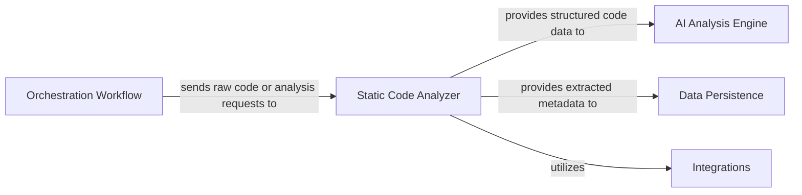
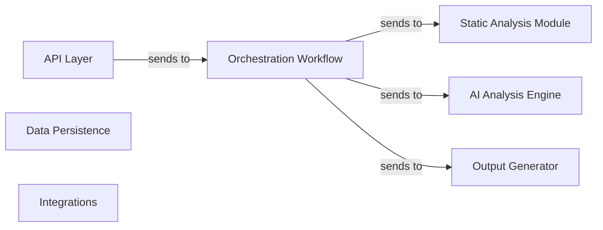

# Interpreting Codeboarding Diagrams & Documentation

## Overview

This guide explains how to read and understand the diagrams and documentation generated by CodeBoarding. You will learn to interpret the structural diagrams created from static analysis and AI-driven abstractions, as well as how to navigate the Markdown, HTML, and MDX formatted output. This knowledge equips you to quickly grasp architectural insights and component relationships in complex Python codebases.

---

## 1. Understanding the Diagram Structure

### What You Are Seeing

CodeBoarding generates high-level diagrams that visualize the architecture and flow within your codebase. These diagrams represent components, their relationships, and interactions as extracted through a combination of static analysis and AI-driven heuristics.

- **Nodes** represent distinct components or modules within the codebase.
- **Edges** show directed relationships such as invocations, data exchanges, or dependencies.
- **Labels** on edges describe the type of interaction (e.g., "invokes analysis on", "provides structured code data to").

This layered information helps reveal the organization and communication paths between components at a glance.

<Accordion title="Example Mermaid Diagram Excerpt">

</Accordion>

### Value & Usefulness

Reading these diagrams answers questions such as:
- How does static code analysis feed into AI-based interpretation?
- Where is analysis data stored and retrieved?
- What external systems or integrations are utilized?

This empowers you to see the full architecture pipeline and understand the flow of data and control.

---

## 2. Navigating the Generated Documentation Formats

### Markdown, HTML, and MDX Outputs

CodeBoarding produces documentation in multiple formats to fit various workflows:

- **Markdown**: Ideal for README files or lightweight documentation sites.
- **HTML**: Suitable for rich web-based browsing with interactive diagrams.
- **MDX**: Extends Markdown with JSX components, ideal for advanced documentation portals and interactive experiences.

Each format includes the following key sections:

- **Interactive Diagrams (Mermaid.js)**
- **Component Descriptions**: Detailed textual explanations about each module or service.
- **Related Source Code Links**: Quick navigation to relevant classes or functions extracted from the source repository.
- **FAQ and Additional Resources**

<Note>
Having these multiple formats means you can choose the best fit for your documentation pipeline or integrate diagrams seamlessly into your development tooling.
</Note>

### Example Mermaid Diagram in Markdown

```markdown

```

---

## 3. Key Components You Will Encounter

CodeBoarding’s diagrams and documentation frequently reference these pivotal components:

| Component Name           | Purpose Summary                                                                                   |
|-------------------------|-------------------------------------------------------------------------------------------------|
| Static Code Analyzer     | Parses source with AST-based methods, building foundational graphs like call and structure graphs.
| Orchestration Workflow   | Central control that sequences analysis stages and manages data flow.
| AI Analysis Engine       | Uses AI models to interpret structured code data and generate higher-level insights.
| Data Persistence         | Safely stores and retrieves analysis results and metadata.
| Integrations             | Interfaces with external tools such as version control systems or CI/CD pipelines.
| Output Generator         | Converts analysis into human-readable formats enhanced with interactive diagrams.

<AccordionGroup title="Referenced Source Code Locations">
<Accordion title="Static Code Analyzer">
- `static_analyzer/pylint_analyze/call_graph_builder.py`
- `static_analyzer/pylint_analyze/structure_graph_builder.py`
</Accordion>
<Accordion title="API Layer">
- `local_app.py`
</Accordion>
<Accordion title="AI Analysis Engine">
- `agents/agent.py`
- `agents/meta_agent.py`
- `agents/planner_agent.py`
</Accordion>
<Accordion title="Data Persistence">
- `duckdb_crud.py`
</Accordion>
<Accordion title="Integrations">
- `github_action.py`
- `repo_utils.py`
</Accordion>
</AccordionGroup>

---

## 4. Step-by-Step: How to Quickly Grasp Diagram Insights

Follow this user-centric flow to extract maximum value from CodeBoarding’s generated artifacts:

<Steps>
<Step title="Locate the Main Diagram">
Open the top-level diagram representing the core components and their interaction.
</Step>
<Step title="Identify Major Components">
Focus on key modules like Static Code Analyzer and AI Analysis Engine to understand your code parsing and analysis workflow.
</Step>
<Step title="Follow the Data Flow Arrows">
Trace arrows showing how data moves between components (e.g., raw code passed for analysis, results stored).
</Step>
<Step title="Expand Details as Needed">
Explore linked sub-documents or related code examples to deepen understanding of specific parts.
</Step>
<Step title="Use Source Code References">
Click or follow links to actual source files/functions to verify or explore implementation basics.
</Step>
<Step title="Validate Against Your Own Project">
Cross-check these architectural views and component boundaries with the real structure of your codebase.
</Step>
</Steps>

---

## 5. Practical Tips and Common Pitfalls

- **Tip:** Start with the highest-level diagram first before drilling down into subcomponents to avoid getting lost.
- **Tip:** Use the interactive Mermaid.js diagrams for faster navigation and better visual comprehension.
- **Tip:** Take advantage of related source code links to bridge between high-level architecture and concrete implementation.
- **Common Pitfall:** Confusing component names—always refer to the provided descriptions for clear purpose.
- **Common Pitfall:** Overlooking the role of the Orchestration Workflow, which coordinates the entire data and process pipeline.

<Warning>
Remember that these diagrams and docs reflect the current capabilities and should be corroborated with live code for accuracy.
</Warning>

---

## 6. Troubleshooting Understanding

If you find parts of the diagram or documentation unclear:

- Revisit the [Core Concepts & Terminology](https://your-docs-link/overview/architecture-core-concepts/core-concepts-terminology) page for foundational definitions.
- Review the [System Architecture Overview](https://your-docs-link/overview/architecture-core-concepts/system-architecture-overview) for a broader picture.
- Check out the [Getting Started: Quick Validation & Output Review](https://your-docs-link/getting-started/configuration-first-run/quick-validation) guide to confirm what outputs you should expect.

---

## 7. Next Steps

After mastering diagram interpretation:

- Explore [Customizing the Analysis Process](https://your-docs-link/guides/core-workflows/customizing-analysis) to tailor output.
- Review [Integrating CodeBoarding](https://your-docs-link/overview/features-integrations/integration-touchpoints) for embedding outputs in your workflows.
- Dive into [Best Practices for Visualizations](https://your-docs-link/guides/best-practices/visualization-tips) for enhanced documentation.

---

## 8. Additional Resources

- CodeBoarding Official Demo: [https://www.codeboarding.org/demo](https://www.codeboarding.org/demo)
- GitHub Generated OnBoardings Repository: [https://github.com/CodeBoarding/GeneratedOnBoardings](https://github.com/CodeBoarding/GeneratedOnBoardings)
- FAQ: [https://github.com/CodeBoarding/GeneratedOnBoardings/tree/main?tab=readme-ov-file#faq](https://github.com/CodeBoarding/GeneratedOnBoardings/tree/main?tab=readme-ov-file#faq)

---

## Callout Summary

<Info>
This page empowers you to understand CodeBoarding’s architectural diagrams and documentation outputs so you can quickly unlock codebase insights, validate component roles, and navigate generated content effectively.
</Info>

<Check>
- Identify key architectural components and their interactions.
- Use output documentation formats best suited for your workflow.
- Follow data flow and related source links to bridge architecture and code.
- Consult core concept pages if confusion arises.
</Check>

---

Thank you for exploring CodeBoarding's insightful visualizations!

---