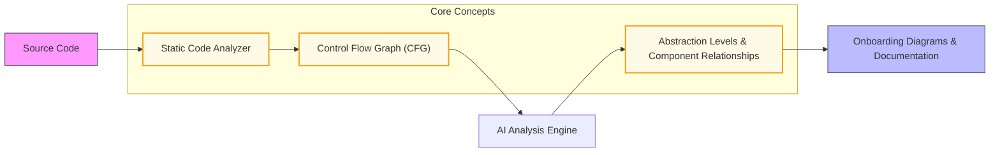

# Core Concepts & Terminology

Understanding the foundational terminology and concepts of CodeBoarding is essential for navigating its architecture and effectively interpreting its outputs. This page introduces key terms such as **modules**, **control flow graph (CFG)**, **abstraction levels**, **component relationships**, and onboarding diagrams. Familiarity with these terms equips you to fully leverage CodeBoarding’s powerful codebase analysis and visualization capabilities.

---

## Essential Terms Explained

### Modules
Modules are the distinct, logical units or packages within a codebase that group related functionality. CodeBoarding identifies modules by analyzing the project’s structure and code dependencies, helping you understand how the codebase is organized into functional domains or subsystems.

### Control Flow Graph (CFG)
The Control Flow Graph is a directed graph representing all possible paths that might be traversed through a program during its execution. In CodeBoarding, the CFG underpins how modules and components relate by modeling the flow of control statements such as loops, branches, and function calls. This structured representation enables precise extraction of dependencies and interaction points within the code.

### Abstraction Levels
Abstraction levels refer to the different granularities at which the codebase can be understood or visualized.

- **Low-Level Abstraction:** Details such as individual functions, methods, and line-by-line control flows.
- **Mid-Level Abstraction:** Groupings of functions into classes, modules, or components.
- **High-Level Abstraction:** Architectural patterns, system-wide workflows, and component roles.

CodeBoarding utilizes AI-powered multi-agent analysis to build and navigate these abstraction levels, enabling users to zoom in and out on the complexity as needed.

### Component Relationships
This term describes the various ways code components interact or depend on each other within the codebase.

- **Call Relationships:** Connections where functions or methods invoke others.
- **Structural Relationships:** How modules and classes compose or contain other elements.
- **Data Flow Relationships:** How data moves and transforms between components.

CodeBoarding merges static and AI-driven analysis to map these relationships accurately, providing a comprehensive architectural picture.

### Onboarding Diagrams
Onboarding diagrams are interactive, high-level visualizations generated by CodeBoarding that depict the organization and flow within a codebase. These diagrams focus on clarity and usefulness for developers new to the project, highlighting key modules, the flow between them, and abstraction layers without overwhelming detail.

They form a bridge between raw code and human comprehension, making complex systems approachable and accelerating ramp-up time.

---

## How These Concepts Fit Into CodeBoarding’s Workflow

1. The **Static Code Analyzer** parses raw source code, constructing the **Control Flow Graph** which reveals all code execution paths.
2. This graph data feeds into the **AI Analysis Engine**, which synthesizes components, their roles, and relationships across multiple abstraction levels.
3. The insights are presented concretely through **Onboarding Diagrams**, designed for clarity, simplifying the complexity into digestible visual maps.

This flow ensures that CodeBoarding’s outputs are both accurate, from solid static foundations, and human-friendly, powered by smart abstraction.

---

## Practical Tips for Users

- **Start with high-level onboarding diagrams:** These provide a broad orientation before diving into more detailed views.
- **Use abstraction layers wisely:** Toggle between abstraction levels to focus on architecture or detailed code behavior depending on your immediate need.
- **Understand CFGs as the backbone:** Grasping the basics of control flow graphs helps in interpreting module interdependencies.
- **Look out for component relationships:** These reveal hidden code dependencies that can impact refactoring or onboarding.

---

## Common Pitfalls to Avoid

- **Skipping terminology:** Without understanding these core concepts, interpreting diagrams and outputs can be confusing.
- **Assuming diagrams show line-by-line code:** Onboarding diagrams intentionally abstract away low-level details for clarity.
- **Ignoring the integration of AI and static results:** Both layers are indispensable; static analysis grounds accuracy, while AI adds interpretability.

---

For deeper context on how these terms integrate into the whole system, see the [System Architecture Overview](/overview/architecture-core-concepts/system-architecture-overview).

To better understand the user scenarios where these concepts come to life, visit [Who Is It For? Key Use Cases](/overview/intro-value-prop/target-audience-use-cases).

---

<AccordionGroup title="Glossary of Key Terms">
<Accordion title="Module">
A logical container grouping related code units, such as a package or namespace.
</Accordion>
<Accordion title="Control Flow Graph (CFG)">
A directed graph that maps all possible paths of code execution for understanding flow and dependencies.
</Accordion>
<Accordion title="Abstraction Level">
The degree of detail visible—ranging from individual code lines/functions to architectural overviews.
</Accordion>
<Accordion title="Component Relationship">
How code components invoke, contain, or depend on one another within the codebase.
</Accordion>
<Accordion title="Onboarding Diagram">
An interactive visualization that summarizes key modules and relationships to aid new developers’ understanding.
</Accordion>
</AccordionGroup>

---

## Next Steps

- Explore the practical application of these concepts in the [System Architecture Overview](/overview/architecture-core-concepts/system-architecture-overview) page.
- See how CodeBoarding visualizes complex codebases in diagrams under [Interpreting Codeboarding Diagrams & Documentation](/guides/getting-started/understanding-diagrams).
- Start analyzing your own repository with guidance from [Running Your First CodeBase Analysis](/getting-started/configuration-first-run/first-analysis).

---

<Note>
Mastering these core concepts transforms CodeBoarding from a black box into a powerful ally for understanding and documenting any Python codebase.
</Note>
