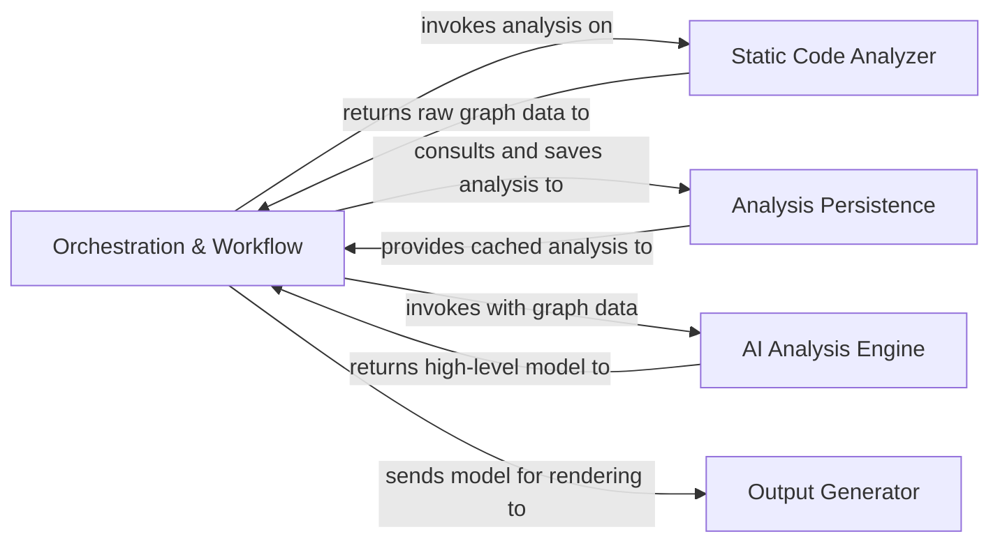
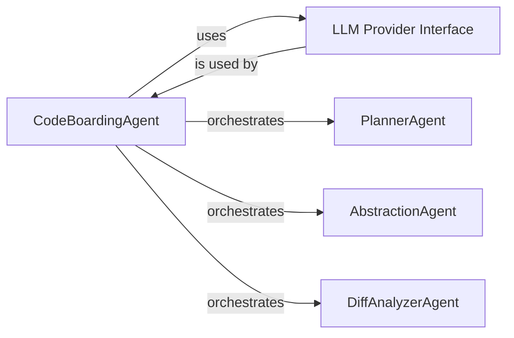

# System Architecture Overview

Explore the high-level architecture of **CodeBoarding** and understand how its core components interact to transform raw source code into meaningful, AI-enhanced visual representations. This overview walks you through the system’s orchestration workflow, static analysis, AI-powered interpretation, persistent storage, and output generation — illustrating the seamless journey from code to comprehensive diagrams.

---

## Architecture at a Glance

This diagram highlights how CodeBoarding orchestrates the entire analysis pipeline, connecting foundational static analysis with intelligent AI processing and final visual output.

---

## Core Components Explained

### Orchestration & Workflow

The heart of CodeBoarding’s system, this component coordinates the entire analysis journey:

- Receives raw source code or analysis requests.
- Triggers the static analyzer to parse and extract structured code data.
- Checks with the persistence layer to leverage cached results or to enable efficient incremental analysis.
- Invokes the AI Analysis Engine with enriched graph data for advanced interpretation.
- Sends the finalized high-level model to the output generator for rendering.

It ensures the seamless flow and proper sequencing of complex tasks, making the analysis accurate and scalable.

### Static Code Analyzer

This module acts as the system’s eyes into the source code. Using robust Abstract Syntax Tree (AST) analysis and graph-building techniques, it:

- Parses raw source code without AI to maintain precision.
- Constructs foundational data structures such as call graphs and structure graphs.
- Extracts essential code metadata — the building blocks for deeper AI-driven insights.
- Provides all structured data back to the orchestration pipeline and onwards to AI analysis and persistence.

Think of it as transforming a complicated codebase into a detailed map.

### AI Analysis Engine

The cognitive core of CodeBoarding, this subsystem powers insight beyond static parsing. It uses a multi-agent AI framework to:

- Interpret raw graph data from static analysis.
- Detect architectural patterns, component roles, and design abstractions.
- Analyze differences between code versions to highlight impacts.
- Collaborate across specialized agents like the PlannerAgent, AbstractionAgent, and DiffAnalyzerAgent to build a rich mental model of your codebase.

This AI Engine effectively thinks about your code at a higher level — summarizing, planning, and analyzing changes to provide a comprehensive architectural overview.

### Analysis Persistence

To maximize efficiency and support scalability, this component:

- Serializes and stores all analysis models and artifacts in a structured format (JSON).
- Enables caching of previous results to avoid redundant processing.
- Supports incremental analysis by maintaining historical context and baselines.

By managing data storage seamlessly, persistence supports quick retrieval and consistency across analysis runs.

### Output Generator

The final stage turning analysis into actionable insights:

- Consumes the rich, structured models prepared by the AI engine.
- Renders outputs into multiple formats such as Markdown, HTML, and Sphinx documentation.
- Generates interactive diagrams leveraging Mermaid.js to visualize complex code relationships clearly.
- Recent updates have focused on streamlining this component for efficient, impactful output.

This allows engineers, documenters, and AI agents to consume the results in intuitive, interactive ways.

---

## Why This Architecture Matters

By structuring CodeBoarding in these clear, decoupled stages, users get:

- **Accuracy**: Precise static analysis ensures foundation data is trustworthy.
- **Intelligence**: AI-driven interpretation surfaces architectural insights and abstracts complexity.
- **Performance**: Persistence caching and orchestration optimize processing time and resource use.
- **Usability**: Rich outputs and diagrams make results accessible and actionable.

Together, these components facilitate smooth, automated comprehension of even the most complex Python codebases.

---

## Getting Started

To dive deeper:

- Start with the [Orchestration & Workflow](https://github.com/CodeBoarding/CodeBoarding/blob/main/.codeboarding/Orchestration_Workflow.md) module.
- Explore how [Static Code Analyzer](https://github.com/CodeBoarding/CodeBoarding/blob/main/.codeboarding/Static_Code_Analyzer.md) transforms raw code.
- Understand the multi-agent [AI Analysis Engine](https://github.com/CodeBoarding/CodeBoarding/blob/main/.codeboarding/AI_Analysis_Engine.md) and its specialized agents.
- Learn how analysis results persist and accelerate your workflow.
- Review how the [Output Generator](https://github.com/CodeBoarding/CodeBoarding/blob/main/.codeboarding/Output_Generator.md) brings insights to life.

Each component is documented with detailed explanations and source code references for deep technical understanding.

---

For practical use, see the [Getting Started guides](../../getting-started/setup-installation/prerequisites) and [Product Introduction & Value](../intro-value-prop/what-is-codeboarding) to grasp how this architecture benefits you directly.

---

<Tip>
For the best experience and highest-quality diagrams, configure your system to use the recommended LLM provider, such as Google Gemini-2.5-Pro.
</Tip>

---

This overview provides a comprehensive yet approachable insight into how CodeBoarding’s system architecture supports transforming static code into high-value documentation and visualization.

---

## References

- [Orchestration & Workflow](https://github.com/CodeBoarding/CodeBoarding/blob/main/.codeboarding/Orchestration_Workflow.md)
- [Static Code Analyzer](https://github.com/CodeBoarding/CodeBoarding/blob/main/.codeboarding/Static_Code_Analyzer.md)
- [AI Analysis Engine](https://github.com/CodeBoarding/CodeBoarding/blob/main/.codeboarding/AI_Analysis_Engine.md)
- [Output Generator](https://github.com/CodeBoarding/CodeBoarding/blob/main/.codeboarding/Output_Generator.md)
- [Analysis Persistence (JSON)](https://github.com/CodeBoarding/CodeBoarding/blob/main/diagram_analysis/analysis_json.py)

---

Explore further to master your understanding of how CodeBoarding transforms codebases with AI-powered analysis and visual storytelling.
