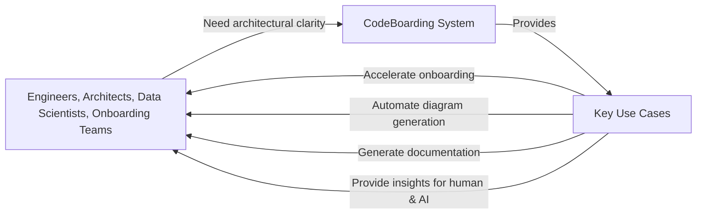

# Who Is It For? Key Use Cases

## Unlocking Clarity for Complex Python Systems
This page speaks directly to engineers, architects, data scientists, and onboarding teams who regularly face the challenge of understanding, documenting, and collaborating on complex Python codebases. CodeBoarding empowers you to transform sprawling, intricate repositories into clear, actionable architectural insights—accelerating onboarding, improving knowledge sharing, and streamlining maintenance.

---

## Who Benefits Most from CodeBoarding?
- **Engineers** diving into unfamiliar code for bug fixes, feature extensions, or refactoring.
- **Software Architects** seeking rapid architectural visualization to inform design decisions.
- **Data Scientists** integrating or auditing Python-based data pipelines.
- **Onboarding Teams** tasked with bringing new collaborators up to speed quickly and effectively.

Each of these roles wrestles with complexity and documentation gaps that slow down productivity. CodeBoarding bridges that gap by automatically generating rich, interactive diagrams paired with insightful documentation—saving you hours or days otherwise spent deciphering code.

---

## Key Use Cases

### 1. Accelerated Onboarding for New Team Members
Bringing new developers or analysts onto a project is often time-consuming and fragmented. CodeBoarding's automated onboarding generation analyzes entire GitHub repositories, producing comprehensive, navigable insights into:
- Module responsibilities
- Key interactions and dependencies
- Architectural patterns and abstractions

This lets newcomers grasp the system’s structure and data flows rapidly, reducing the learning curve drastically.

### 2. Automated, Up-to-Date Project Diagrams
Maintaining architecture diagrams manually is error-prone and quickly outdated. When integrated into your workflow or CI/CD pipelines via GitHub Actions or the API, CodeBoarding continuously regenerates:
- High-level interactive Mermaid.js diagrams
- Markdown or HTML documentation enriched with architectural insight

Automate diagram generation to keep your reference materials accurate and reflective of your latest code.

### 3. Documentation at Scale for Complex Systems
Complex projects often span many modules, submodules, and services. CodeBoarding's static code analysis combined with AI-driven multi-agent reasoning distills sprawling codebases into:
- Layered architectural views with customizable depth
- Component roles and their relationships
- Narrative explanations of design patterns and intents

Documentation becomes a living artifact that evolves alongside your system.

### 4. Rapid Architectural Insights for Humans and AI
CodeBoarding’s detailed analysis output is consumable by both developers and AI agents:
- Developers get a structured, visual understanding of the system
- AI-powered assistants (like CodeBoarding’s MCP Server or IDE extensions) leverage the generated docs to answer architectural questions or assist with development tasks

This dual accessibility enhances collaboration, knowledge transfer, and tooling integration.

---

## Real-World Scenario: Onboarding a Data Science Team
Imagine a data science team joins a company and needs to quickly understand the data ingestion and preprocessing pipelines coded in Python. Instead of manually reading through hundreds of files, they point CodeBoarding to the GitHub repo. Within minutes, they receive:
- An overview diagram showing pipeline stages
- Detailed documentation explaining each component’s purpose
- Links to source code snippets and related classes

This ready-to-use documentation lets the team start contributing without delay, increasing velocity and reducing risk.

---

## Practical Tips for Users
- **Leverage GitHub Actions** to automate onboarding and diagram generation on every commit.
- **Use the FastAPI HTTP endpoints** to integrate CodeBoarding into internal tooling or dashboards.
- **Customize output depth** via environment variables (`DIAGRAM_DEPTH_LEVEL`) to get as detailed or high-level views as needed.
- **Integrate with IDEs** to surface architecture insights inline during development.

---

## Navigating From Here
To dive deeper into how CodeBoarding achieves these benefits, explore:
- [What is CodeBoarding?](./what-is-codeboarding) — a high-level introduction
- [System Architecture Overview](../architecture-core-concepts/system-architecture-overview) — detailed component descriptions and flow
- [Quick Feature Overview](../features-integrations/quick-feature-tour) — concrete features and capabilities
- [Integrating CodeBoarding](../features-integrations/integration-touchpoints) — setup and automation guides

---

## Summary Diagram of Related Components

---

## Troubleshooting Common User Challenges

<AccordionGroup title="Common Challenges & Solutions">
<Accordion title="The diagrams generated seem too detailed or overwhelming">
Try adjusting `DIAGRAM_DEPTH_LEVEL` in your environment settings. Lower values produce higher-level abstractions.
</Accordion>
<Accordion title="Documentation files are not appearing after job completion">
Verify your environment variable `ROOT_RESULT` points to a valid directory with write permissions. Check job status endpoint for errors.
</Accordion>
<Accordion title="Onboarding generation fails for private repos">
Ensure GitHub authentication tokens are correctly configured in your environment (`GITHUB_TOKEN`).
</Accordion>
<Accordion title="Output format not as expected">
Confirm the requested output extension is one of `.md`, `.html`, or `.mdx`. Unsupported formats default to markdown.
</Accordion>
</AccordionGroup>

---

With CodeBoarding, your teams gain clear, actionable insights into complex Python systems, unlocking faster onboarding, better documentation, and smarter collaboration.

---

_Ready to see CodeBoarding in action? Head to the [Demo](https://www.codeboarding.org/demo) or start analyzing your repositories today!_

---

## References & Further Reading
- [What is CodeBoarding?](./what-is-codeboarding)
- [System Architecture Overview](../architecture-core-concepts/system-architecture-overview)
- [Quick Feature Overview](../features-integrations/quick-feature-tour)
- [Integrating CodeBoarding](../features-integrations/integration-touchpoints)

---