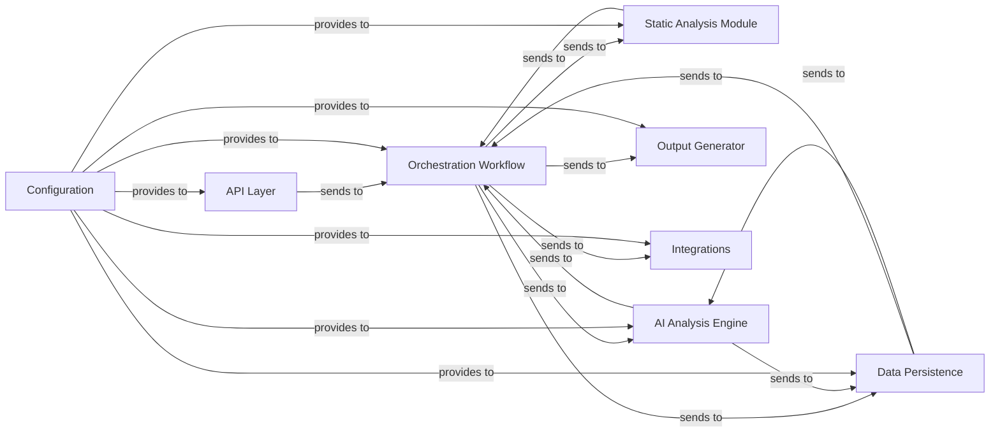

# What is CodeBoarding?

## Unlocking Codebase Understanding with Clarity and Speed

CodeBoarding is an open-source tool that transforms large Python codebases into high-level, interactive diagrams using a powerful combination of static analysis and Large Language Model (LLM) agents. It makes onboarding faster, documentation richer, and comprehension of complex projects intuitive — helping developers and teams visualize, document, and explore their source code effectively.

### Why CodeBoarding Matters
- **Simplifies Onboarding:** New team members grasp project architecture and code relationships quickly through clear visual models.
- **Accelerates Understanding:** Converts intricate Python projects into digestible diagrams that reveal modules, flows, and dependencies.
- **Generates Actionable Documentation:** Automatically produces interactive Markdown and HTML diagrams directly from source code.
- **Enhances Collaboration:** Bridges communication gaps by offering a unified, human- and AI-friendly overview of codebases.

### Who Benefits from CodeBoarding?
- Python developers diving into unfamiliar or large projects
- Engineering teams needing fast, everyday documentation refreshes
- Technical writers creating up-to-date development guides
- DevOps and CI/CD engineers integrating code analysis into pipelines

---

## Introducing CodeBoarding: Your Codebase Navigator

At its core, CodeBoarding is not just another static analysis tool. It combines traditional code parsing techniques with advanced AI-driven agents to build high-level, contextual models of your codebases. These models are then visualized as interactive diagrams, helping users navigate and understand the structure and behavior of Python projects comprehensively.

The tool automatically extracts modules and their relationships from the code’s control flow graph and employs LLMs to abstract and summarize complex code patterns into intuitive diagrams. This dual approach ensures accuracy and richness, making the produced insights trustworthy and easy to contextualize.

### Core Purpose
CodeBoarding was created to solve the problem of onboarding friction and documentation drift in evolving Python projects. It enables users to:
- Quickly visualize the architecture of existing codebases
- Generate meaningful, navigable documentation from source code
- Use AI to abstract details while preserving accuracy

### What Makes CodeBoarding Unique?
- **Hybrid Analysis:** Integrates static analysis with multi-agent LLM frameworks for unmatched understanding.
- **Interactive Outputs:** Produces Mermaid.js-based diagrams for seamless integration into docs, IDEs, and CI pipelines.
- **Open Source & Extensible:** Designed to adapt, extend, and integrate with the developer tools you already use.

---

## Key Features & Capabilities

### Visualizing Complexity with Precision
- Extracts module-level graphs from code control flow to show how parts of the project interconnect.

### AI-Driven Abstraction
- Uses a multi-agent AI system (including Planner, Abstraction, and Diff Analyzer agents) to summarize code, classify components, and detect architectural patterns.

### Interactive Diagram Generation
- Produces human-friendly, interactive Mermaid.js diagrams enabling users to explore project architecture in detail.

### Rich Output Formats
- Supports Markdown, HTML, and Sphinx documentation outputs, letting you embed visualizations anywhere.

### Multi-Provider LLM Support
- Connects with major LLM APIs like OpenAI, Anthropic, Google Gemini, and AWS Bedrock to power analysis.

### Real-World Scenario
Imagine joining a new project with thousands of Python files. Instead of hunting blindly, you run CodeBoarding to instantly get a clear map of the codebase modules and their relationships, complete with AI-generated summaries of each component’s role. This reduces your onboarding time dramatically and allows you to focus on coding.

---

## Why Should You Care?

### Achieve Faster Onboarding & Deeper Insight
With CodeBoarding, developers spend less time lost in unfamiliar code and more time contributing meaningfully. Teams get consistently updated documentation without manual effort, reducing the documentation gap and communication overhead.

### Common Use Cases
- New hires exploring project structure and dependencies
- Technical writers creating high-level architecture overviews
- Dev leads reviewing project changes and refactoring impact
- CI/CD pipelines automatically generating up-to-date diagrams

### Before and After
| Without CodeBoarding   | With CodeBoarding                 |
|-----------------------|---------------------------------|
| Manual documentation prone to being outdated | Automated diagrams and docs always in sync |
| Steep learning curve for new developers    | Intuitive, AI-augmented architectural maps  |
| Time-intensive code reviews                  | Quick insights from summarized code         |

### Return on Investment
- Cut onboarding durations by days or weeks
- Reduce time spent understanding legacy code
- Improve developer confidence and codebase ownership

---

## How to Get Started with CodeBoarding

### Quick Preview
Start by providing a GitHub URL of a Python repo you want to analyze. CodeBoarding will clone, analyze the codebase, run its AI abstraction, and generate interactive documentation automatically.

### Prerequisites
- Python 3.11 environment
- Access to at least one supported LLM API key (OpenAI, Anthropic, Google Gemini, etc.)
- Environment variables configured (like `REPO_ROOT`, `OPENAI_API_KEY`)

### Next Steps
- Explore the [Getting Started](https://your-docs-site/getting-started) section for installation and initial usage
- Dive into [Features & Integrations](https://your-docs-site/overview/features-integrations/quick-feature-tour) to learn about customization
- See live examples of generated diagrams in our [GeneratedOnBoardings Repository](https://github.com/CodeBoarding/GeneratedOnBoardings)

---

## Visualizing CodeBoarding's Role in Your Development Workflow

This diagram demonstrates how CodeBoarding's components collaborate to receive requests, process source code, apply AI-powered abstraction, store results, and generate rich documentation.

---

<Info>
Start your CodeBoarding journey by cloning the repository from [CodeBoarding GitHub](https://github.com/CodeBoarding/CodeBoarding) and configuring your environment with your preferred LLM API keys.
</Info>

<Note>
CodeBoarding currently supports Python 3.x projects and LLM providers including OpenAI, Anthropic, Google Gemini, and AWS Bedrock.
</Note>